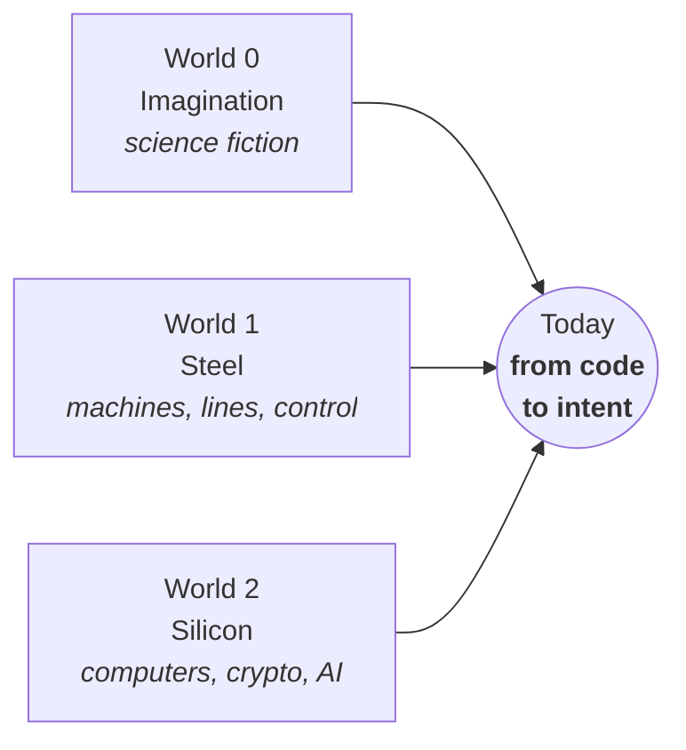
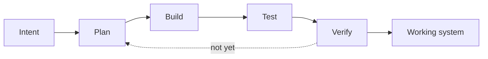

# 1 · Three worlds

[Contents](../README.md) · [← 0 · Preface](00-preface.md) · Next: [2 · Manifesto →](02-manifesto.md)

> **In one line:** imagination, machines and code — three worlds led me to the same place: from code to intent.
> On the site: [homensai.com](https://homensai.com/)

---

## World 0 · Tales, books and science fiction

Before any machine or computer there were books. From the age of thirteen or fourteen I read
every science-fiction book I could find: robots, thinking machines, new worlds, civilisations.
It shaped the way I think more than anything else.

Imagination came first. Everything else was a way to get closer to it.

## World 1 · The mechanical world, since 2002

Production lines built turnkey. Machines and mechanisms. Controllers and computers that run
them. And almost always custom work: the customer brought an idea, we brought the
implementation.

We kept building new equipment, and I always tried to improve it — make it more beautiful,
more technological, simpler. It was the world of a time when mechanical engineering led the
economy.

## World 2 · The digital world, since 1991

Computers since school. Then, step by step:

| Years | What |
|-------|------|
| 1993–1998 | Systems engineering at university; first steps with AI, in Lisp |
| 1997–1998 | Public-key cryptography (PGP); distributed key cracking |
| 2002–2023 | 3D modelling of equipment |
| 2018 → | GPU rigs, cryptocurrency |
| 2023 → | AI as an everyday working tool; local AI lab |

## Where they meet

For most of my life I lived in both worlds at the same time. Pure hardware or pure code never
held my interest. The interesting part — and the bigger opportunity — begins where the two meet.

## The shift: from code to intent

Before, between an idea and a working system stood lines of code — thousands of them, written by
hand. Now there is a new layer: you state the **intent**, and tools help to plan, build and test.

The code does not disappear. It moves one level down — like machine code moved under
high-level languages decades ago. What moves up is the human part: knowing what you want, and
being able to check that you got it.

---

[Contents](../README.md) · [← 0 · Preface](00-preface.md) · Next: [2 · Manifesto →](02-manifesto.md)
