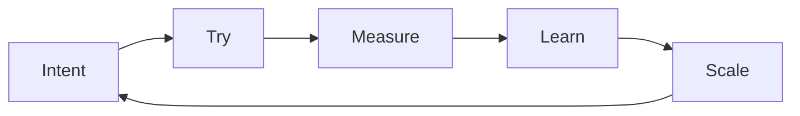

# 2 · Manifesto — Imagine wider. Build faster.

[Contents](../README.md) · [← 1 · Three worlds](01-three-worlds.md) · Next: [3 · Principles →](03-principles.md)

> **In one line:** results depend less on details and more on the width of the mind behind them.
> On the site: [Manifesto](https://homensai.com/manifesto.html)

---

## We are entering a world of imagination

I see the present not as a chance to apply old knowledge, but as the opening of a world of
completely new possibilities. In this world, turning an idea into reality depends on the person:
on the width of his mind, on his understanding of philosophy, and above all on his imagination.

The need to understand every small task and process is shrinking. The limits that remain are
mostly the limits we carry ourselves.

## Growth is a loop, not a line

Every turn of the loop is faster than the last one, because the tools get better and because you
do. Growth is not a straight road; it is the same five steps, repeated with more speed and more
confidence.

## The hardest part is the idea

Inventing something is the hard part. Building has never been easier.

For most of history, years, specialists, teams, budgets and approvals stood between an idea and
its reality. Modern tools remove most of that distance. What remains is the idea itself.

> "Imagination is more important than knowledge." — Albert Einstein
>
> Today it is also more practical.

You no longer need to be a narrow specialist to build your idea. You need a wide and deep
imagination — and not to limit yourself.

Three consequences:

- **Ideas are scarce.** Inventing is the hard part.
- **Tools multiply.** Refusing modern tools means giving up your chance to succeed — and to make
  your dreams real.
- **Dreams keep us whole.** Realising your own plans is part of psychological health.

## Science fiction is a specification

Science-fiction writers were not dreamers. They were visionaries — they wrote the specification,
and we are implementing it. Almost everything they described will, in the end, be built.

## Same business. New team.

People decide. AI executes. Every result is verified.

I ran the same order cycle for twenty years: understand, plan, build, verify. In 2008 every step
was done by people. Today a large part of it can be done by AI — but not the deciding, and not
the hands-on skill.

| Stage | 2008 · people | Today |
|-------|---------------|-------|
| 01 Understand — client call, real need, concept | person | **human decides**, AI helps prepare |
| 02 Plan — steps and costing, contract, shipment plan | person | **AI executes**, human approves |
| 03 Build — 3D design, procurement, shop-floor control | person | AI executes the routine, **hands and skill** on the floor |
| 04 Verify — assembly, shipment, commissioning | person | **human decides**, hands and skill on site |

Three rules make this work:

1. **Delegate like a director.** Task, deadline, resources, control — to people and to AI.
2. **Verify like an engineer.** No result counts until it is checked.
3. **Keep the data at home.** Sensitive work runs on local AI.

## The world accelerates

Whether we want it or not, the world is speeding up. The one who refuses to accept it can drop
out of the race. The winner is the one who is ready to test, to try, to take risks, to
implement — and not just hold on to the oar of a sinking boat.

Implement as fast as possible — but always with control: testing and checking all the time.

> Everything around us is a concept. Are you ready to test it on yourself? Your success depends
> on it.

---

[Contents](../README.md) · [← 1 · Three worlds](01-three-worlds.md) · Next: [3 · Principles →](03-principles.md)
