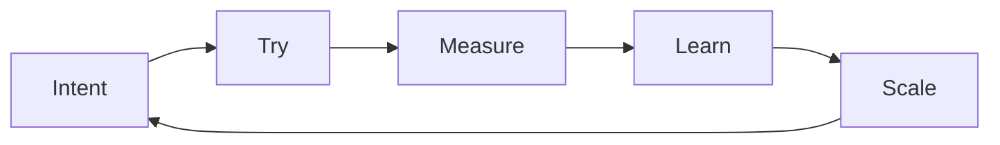

# 2 · Manifesto — Imagine wider. Build faster.

[Contents](../README.md) · [Deutsch](de/02-manifesto.md) · [← 1 · Three worlds](01-three-worlds.md) · Next: [3 · Principles →](03-principles.md)

> **In one line:** results depend less on small details and more on the breadth of vision behind them.
> On the site: [Manifesto](https://homensai.com/manifesto.html)

---

## We are entering a world of imagination

I see the present not as a chance to apply old knowledge, but as the opening of a world of
new possibilities. In this world, turning an idea into reality depends on the person:
on the breadth of his vision, on imagination and systems thinking, and above all on the
quality of the idea.

AI can reduce the amount of routine implementation we do by hand. It does not remove the need to
understand requirements, constraints and how to verify the result. What shrinks is the manual
work on small tasks; what stays is the understanding that lets you say what you want and tell
whether you got it.

## Growth is a loop, not a line

When it works, every turn of the loop is faster than the last one, because the tools get better
and because you do. Growth is not a straight road; it is the same five steps, repeated.

## The hardest part is the idea

Inventing something is the hard part. Building has become much easier.

For most of history, years, specialists, teams, budgets and approvals stood between an idea and
its reality. Modern tools remove a large part of that distance. What remains is the idea itself —
and the work of testing whether it can be done.

> "Imagination is more important than knowledge." — Albert Einstein
> (see [Notes and sources](notes.md#quotation-and-sources))
>
> For building things it is also a practical advantage.

You no longer need to be a narrow specialist to start building your idea. You need a wide and
deep imagination — and the discipline to check it against reality.

Three consequences:

- **Ideas are scarce.** Inventing is the hard part.
- **Tools expand our capabilities.** Refusing modern tools means giving up a large advantage.
- **Dreams keep us whole.** In my own experience, realising my own plans is part of feeling well.
  This is a personal observation, not a medical statement.

## Science fiction is a source of specifications

Science-fiction writers were not only dreamers. Many were visionaries: they described machines and
situations that engineers later worked on. I believe that many of those ideas will, in one form or
another, be built — but each of them has to pass the tests of physics, engineering and cost
([Chapter 3](03-principles.md#feasibility-is-tested-not-assumed)).

## Same business. New team.

People decide. AI executes. Every result is verified.

I ran the same order cycle for twenty years: understand, plan, build, verify. In 2008 every step
was done by people. Today a large part of it can be done by AI — but not the deciding, and not
the hands-on skill.

| Stage | 2008 · people | Today |
|-------|---------------|-------|
| 01 Understand — client call, real need, concept | person | **human decides**, AI helps prepare |
| 02 Plan — steps and costing, contract, shipment plan | person | **AI executes**, human approves |
| 03 Build — 3D design, procurement, shop-floor control | person | AI executes the routine, **hands and skill** on the floor |
| 04 Verify — assembly, shipment, commissioning | person | **human decides**, hands and skill on site |

Three rules make this work:

1. **Delegate like a director.** Task, deadline, resources, control — to people and to AI.
2. **Verify like an engineer.** No result counts until it is checked.
3. **Know where the data goes.** Sensitive work may be better done on local AI, but running a
   model locally does not by itself keep data local
   ([Field guide, section 6](08-field-guide.md#6-know-where-your-data-goes)).

## The world accelerates

The world is speeding up, whether we want it or not. Those who refuse to test new tools may fall
behind; those who test, try and implement — carefully — have an advantage. Holding on to the oar
of a sinking boat is not a strategy.

Implement as fast as you can verify: testing and checking all the time.

> Everything around us is a concept. Are you ready to test it in practice? Your success depends
> on it.

---

[Contents](../README.md) · [Deutsch](de/02-manifesto.md) · [← 1 · Three worlds](01-three-worlds.md) · Next: [3 · Principles →](03-principles.md)
