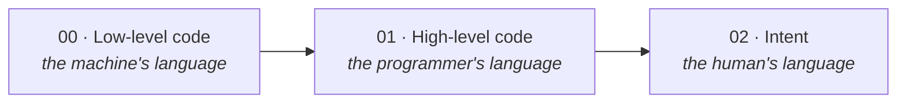
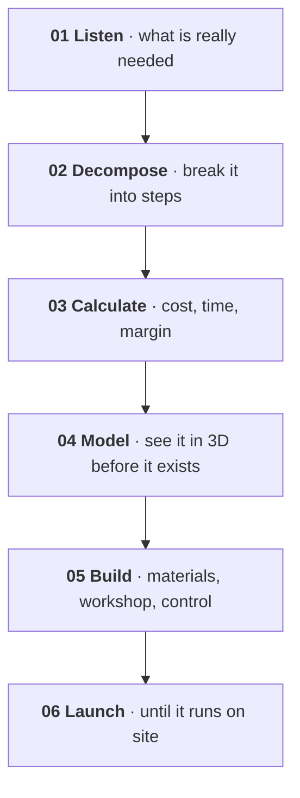
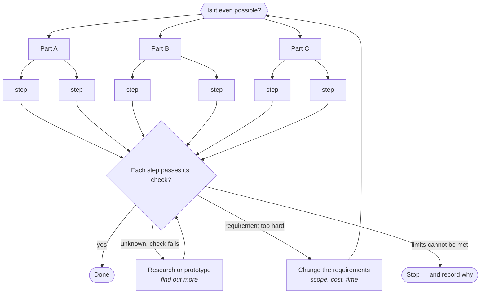

# 3 · Principles — from programming to philosophical management

[Contents](../README.md) · [Deutsch](de/03-principles.md) · [← 2 · Manifesto](02-manifesto.md) · Next: [4 · Physical AI →](04-physical-ai.md)

> **In one line:** how I think, decide and build.
> On the site: [Concept](https://homensai.com/concept.html)

---

## The shift

I believe our world is moving from low-level and high-level programming and design to an area I
call **philosophical management**. This is my own name for it, not a standard step in the
history of programming: it means managing work by intent, ideas and judgement instead of by
code, while still being able to check the result.

Small tasks matter less every year. Results depend more on breadth of vision, on judgement and on
imagination — and on the ability to verify what was built. Many limits that remain are ours, but
not all of them: the others are set by physics, cost and time.

## Six principles

| # | Principle | What it means |
|---|-----------|---------------|
| P-01 | **Imagination first** | The hardest part is the idea. An idea is a starting point; feasibility has to be tested. |
| P-02 | **Everything is a concept** | The only question: are you ready to test it in practice? |
| P-03 | **The best tools — today** | Use the most advanced tools within reach. Heard an idea — start building, and test early. |
| P-04 | **Fast, but verified** | Implement quickly — with control, tests and constant checks. |
| P-05 | **Delegate** | Task, deadline, resources, control. Step in when it really matters. |
| P-06 | **Experimenter** | No institute needed: curiosity, trials, measured results. |

### On P-03 — never postpone

When my company EKVIPTEH started in 2008, our designer drew on paper. I understood that this was a
dead end. As soon as we had a designer who could model in 3D, I introduced it immediately — first
SolidWorks, then Autodesk Inventor, after I heard that the design offices of large plants worked
in it. I bought a powerful computer and graphics cards for it. From 2010 the company
modelled in 3D. (I had already introduced 2D AutoCAD earlier, in 2004; see the
[timeline in Chapter 6](06-path.md#when-3d-came-in).)

For the customer it changed everything: from his technical brief he quickly got a drawing and
saw what he would receive — instead of listening to verbal explanations and rough sketches.
Corrections were made on the spot.

I never postpone. I hear an idea — I try to implement it right away, in a small test first.

### On P-05 — delegation

I always delegated. I delegated what I understood well enough to define the task and to check
the result, and what I could trust to someone else. I gave the task, set the deadline, provided
the resources and monitored progress; I helped if there were questions, and stepped in only in
extreme cases. That was the core of all my work at the company. Today I delegate to AI in the
same way — and the same limit applies: **I delegate only what I can define and verify.** Work I
cannot judge, I do not hand over blindly; I either learn enough to check it or I get someone
who can.

### On P-06 — the experimenter

I count myself among the experimenters: people who, without being at a university or institute,
want wholeheartedly to learn everything new and to understand the world around them. If you
have imagination and the wish to try and to study — really study — you do not have to wade through
outdated academic routines first. In my experience that increases productivity, results and
quality.

## Feasibility is tested, not assumed

An idea is a starting point. Whether it can be built has to be tested against physical,
technical and resource constraints: weight, heat, time, money, safety, available knowledge.
Splitting a task into steps helps to *find out* whether it can be done; it does not prove that
every task can.

## Division of work

**Routine goes to machines. People go to what only people can do.**

Every routine operation — with checks and control — should be handed over as far as possible.
Human time belongs to what is more important and more valuable: the things only a person can
produce.

| Routine · automated, verified | People · only humans |
|-------------------------------|----------------------|
| Reports and paperwork | Ideas and imagination |
| Calculations and schedules | Judgement and decisions |
| Repeated checks | Responsibility |
| Data entry and lookup | Trust and relationships |
| Standard answers | Taste and meaning |

Handing over the routine **frees time**. It does not free you from responsibility — the checks
stay with you.

## Method: from idea to launch

## Uncertainty: start with doubt, finish with an outcome

Some projects I began without being sure they were possible at all. Each time I did the same
thing: split the big task into smaller ones, found out which parts were unknown, and tested those
first — step by step.

Uncertainty at the start is not a reason to stop. It is worked down by consistent, persistent
action and by tests. Projects I began this way were finished — that is my experience, not a
guarantee. A task can turn out to be impossible within the limits of physics, safety, budget or
time. Then the right result is not "Done" but a changed requirement, further research, or a
deliberate stop with the reason written down.

> Now is the time when technology turns into magic. And you can no longer tell which came first.

---

[Contents](../README.md) · [Deutsch](de/03-principles.md) · [← 2 · Manifesto](02-manifesto.md) · Next: [4 · Physical AI →](04-physical-ai.md)
