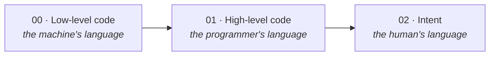
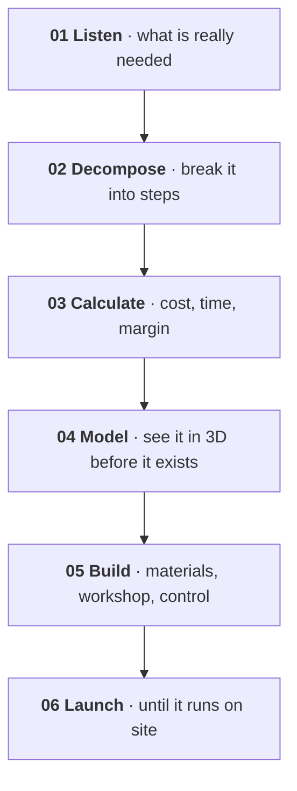
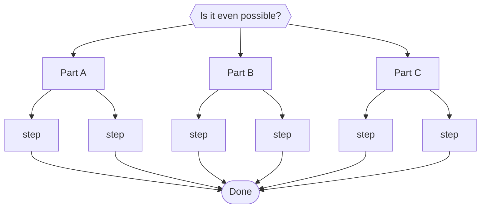

# 3 · Principles — from programming to philosophical management

[Contents](../README.md) · [← 2 · Manifesto](02-manifesto.md) · Next: [4 · Physical AI →](04-physical-ai.md)

> **In one line:** how I think, decide and build.
> On the site: [Concept](https://homensai.com/concept.html)

---

## The shift

I believe our world is moving from low-level and high-level programming and design to an area I
can only call **philosophical management**.

Small tasks matter less every year. Results depend on the width of the mind, on philosophy and on
imagination. The only limits are our own.

## Six principles

| # | Principle | What it means |
|---|-----------|---------------|
| P-01 | **Imagination first** | The hardest part is the idea. Once it exists, it can be built. |
| P-02 | **Everything is a concept** | The only question: are you ready to test it on yourself? |
| P-03 | **The best tools — today** | Use the most advanced tools within reach. Heard an idea — start building. |
| P-04 | **Fast, but verified** | Implement quickly — with control, tests and constant checks. |
| P-05 | **Delegate** | Task, deadline, resources, control. Step in only when it really matters. |
| P-06 | **Experimenter** | No institute needed: curiosity, trials, measured results. |

### On P-03 — never postpone

When my company started in 2008, our designer drew on paper. I understood that this was a dead
end. As soon as we had a designer who could model in 3D, I introduced it immediately — first
SolidWorks, then Autodesk Inventor, after I heard that the design bureaus of large plants worked
in it. I bought a powerful computer and graphics cards for it. From about 2010–2011 we modelled
everything in 3D.

For the customer it changed everything: from his technical brief he immediately got a drawing and
saw what he would receive — instead of listening to explanations "on the fingers". Corrections
were made on the spot.

I never postpone. I hear an idea — I try to implement it right away.

### On P-05 — delegation

I always delegated. I never took on work I did not understand, or work I could trust to someone
else. I gave the task, set the deadline, gave the resources and controlled; I helped if there were
questions, and stepped in only in extreme cases. That was the core of all my work at the company.
Today I delegate to AI in exactly the same way.

### On P-06 — the experimenter

I count myself among the experimenters: people who, without being in a university or institute,
want with all their heart to learn everything new and to understand the world around them. If you
have imagination and the wish to try and to study — really study — you do not have to wade through
outdated academic routines first. That increases productivity, results and quality.

## Division of work

**Routine goes to machines. People go to what only people can do.**

Every routine operation — with checks and control — should be handed over as far as possible.
Human time belongs to what is more important and more valuable: the things only a person can
produce.

| Routine · automated, verified | People · only humans |
|-------------------------------|----------------------|
| Reports and paperwork | Ideas and imagination |
| Calculations and schedules | Judgement and decisions |
| Repeated checks | Responsibility |
| Data entry and lookup | Trust and relationships |
| Standard answers | Taste and meaning |

Handing over the routine **frees time**. It does not free you from responsibility — the checks
stay with you.

## Method: from idea to launch

## Uncertainty: start with doubt, finish with a result

Some projects I began without being sure they were possible at all. Each time I did the same thing:
split the big task into smaller ones and kept going — step by step, stubbornly. Every one of those
projects was finished.

Uncertainty at the start is not a reason to stop. It is solved by consistent, persistent action.
So far I have not met a task that could not, in the end, be solved.

> Now is the time when technology turns into magic. And you can no longer tell which came first.

---

[Contents](../README.md) · [← 2 · Manifesto](02-manifesto.md) · Next: [4 · Physical AI →](04-physical-ai.md)
