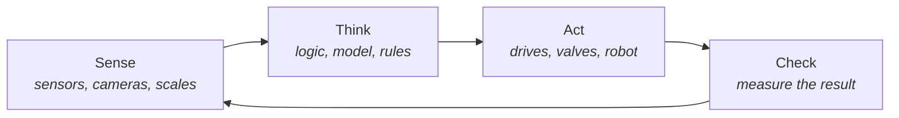
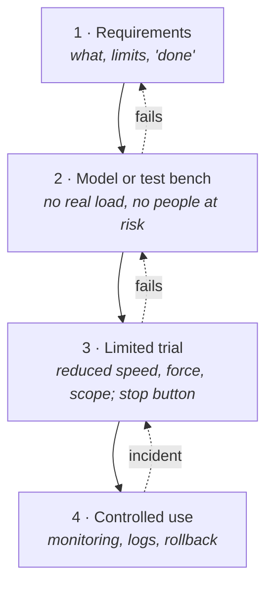

# 4 · Physical AI — testing AI in the physical world

[Contents](../README.md) · [Deutsch](de/04-physical-ai.md) · [← 3 · Principles](03-principles.md) · Next: [5 · Lab →](05-lab.md)

> **In one line:** our world and AI's world meet in machines — that is where AI is really tested.
> On the site: [Concept](https://homensai.com/concept.html) · [Home](https://homensai.com/)

---

## Two physical worlds

AI errors can have real consequences even when the output is text: a specification, a contract
clause, a calculation or a command can all become a decision. When AI influences physical
equipment — a valve, a robot arm, a CNC spindle — testing must also account for the behaviour and
limits of the machine. There a mistake can cost material, time, money — sometimes safety.

Two physical worlds meet here:

| Our physical world — where we live and work | AI's physical world — how AI touches ours |
|---------------------------------------------|-------------------------------------------|
| Workshops, factories, warehouses | Robots and manipulators |
| Offices, homes, streets | Drives, valves, CNC machines |
| People, schedules, money | Sensors, cameras, scales |
| Real constraints: weight, heat, time, safety | Data collected and analysed |

The idea is to stand on the edge of the newest developments — robotic systems, data collection and
analysis — and to check in practice what really works.

## The loop

Every machine I ever built ran the same loop. AI does not change the loop; it changes who can
take part in it.

The fourth step is the one people forget. In the physical world **check** is not optional: the
mixture has the right weight or it does not; the part is within tolerance or it is scrap.

## From idea to a running machine: a staged approach

The first test of an AI-influenced machine should not be on the running machine. The order I
would follow:

Each stage has its own pass criteria, and a failure sends you one stage back, not forward. This
is an editorial outline of a method, **not an engineering certification and not a ready
procedure for starting any specific machine**. For real equipment, the applicable standards,
the manufacturer's instructions and a qualified safety assessment come first.

## Why my background fits here

For twenty years I wrote the logic of machines by hand: conditions, weights, doses, sequences —
which sensors measure level and weight, which controllers to buy, in what order the dosing runs.
A programmer turned my logic into controller code. (More on this in [Chapter 6](06-path.md).)

That is the same skill AI now needs from people: describe the intent precisely, set the rules
and the checks, and verify the result — on a model or test bench first, then on the real machine.

## A practical approach

This is not a prediction and not a pitch. It is a practical approach:

1. **Test it — in stages, and on a real machine only when the earlier stages pass.**
2. **Measure.**
3. **Keep what holds.**

> The world accelerates. Test, adapt, implement — don't hold the oar of a sinking boat.

---

[Contents](../README.md) · [Deutsch](de/04-physical-ai.md) · [← 3 · Principles](03-principles.md) · Next: [5 · Lab →](05-lab.md)
