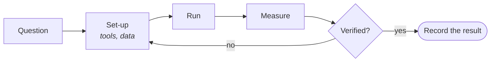

# 5 · Lab — Don't trust it because it's new. Test it.

[Contents](../README.md) · [Deutsch](de/05-lab.md) · [← 4 · Physical AI](04-physical-ai.md) · Next: [6 · Path →](06-path.md)

> **In one line:** every experiment is a question, a test and a measured result — including what failed.
> On the site: [Lab](https://homensai.com/lab.html)

---

## Method: not done until verified

Do not trust a technology because it is new. Do not reject it for the same reason. Test it
yourself.

Failed results are written down too. A failure with a number is worth more than a success without
one.

## Current experiments

| ID | Experiment | Question | Tools | Result / status |
|----|------------|----------|-------|-----------------|
| EXP-001 | **Personal AI Lab** — a local inference server | Can one consumer GPU serve AI models to a whole local network, with the data kept under my control? | RTX 3080, Docker, llama.cpp, Ollama, Open WebUI | *Author-reported; reproducibility details pending.* Qwen 3.5 9B stable at 64k context over LAN; 262k context did not fit in VRAM. Protocol and open fields: [EXP-001](../experiments/EXP-001.md). |
| EXP-002 | **Benchmark Lab** — which model for which GPU | Which local model gives the best quality per gigabyte of VRAM? | Qwen, Gemma, MiniCPM, GGUF | *In progress.* Report in preparation. |
| EXP-003 | **Archive Analyzer** — local AI reads 30,000 project files | Can a local model turn an old contract archive into a table of projects, amounts and years, without sending anything out? | Ollama, Python, LibreOffice | *Planned.* First run on my EKVIPTEH archive. A small synthetic stand-in is in the [worked example](../examples/order-table/README.md). |
| EXP-004 | **Home Learning Portal** — a local AI tutor | Can a local model plus a personal knowledge base teach new skills at one's own pace? | Obsidian, Ollama, Open WebUI | *Planned.* |

The EXP-001 numbers are my own report from a working set-up. They are not yet backed by a
published measurement log: the model file, quantization, back end, launch parameters and metrics
are listed as pending in the protocol. Until they are filled in, treat the result as reported,
not as reproduced.

Why local? Because of the third rule from the [Manifesto](02-manifesto.md): **know where the data
goes.** Local AI means running models on hardware you control. Whether data really stays local
depends on the complete configuration — tools, network access, logging and backups. A contract
archive, customer lists, personal notes: before they are given to any tool, check the data
flows ([Field guide, section 6](08-field-guide.md#6-know-where-your-data-goes)). This book does
not audit, and does not make claims about, the data flows of any particular product.

## Archive: same curiosity, thirty years

| ID | When | What |
|----|------|------|
| ARC-00 | Level 0 | **Science fiction.** Books about AI and robots. Long before code, I met them on paper. |
| ARC-01 | 1990s | **First steps with AI, in Lisp.** A university course "Foundations of AI": a program that guessed an insect from the user's answers. |
| ARC-02 | 1997–1998 | **Public-key cryptography and distributed key cracking.** PGP; then an experiment where thousands of computers each got a piece of one key to brute-force and sent back the result. I see it as the beginning of the idea behind crypto mining. |
| ARC-03 | 2018 → | **GPU mining rigs.** Power, cooling, 24/7 stability. Today the same kind of hardware runs my local AI. |
| ARC-04 | Today | **AI, deep dive.** Local models, agents, orchestration. AI is now my everyday working tool. |

The line through all of it is the same: a question, a machine, and the wish to see with my own eyes
whether it works.

---

[Contents](../README.md) · [Deutsch](de/05-lab.md) · [← 4 · Physical AI](04-physical-ai.md) · Next: [6 · Path →](06-path.md)
