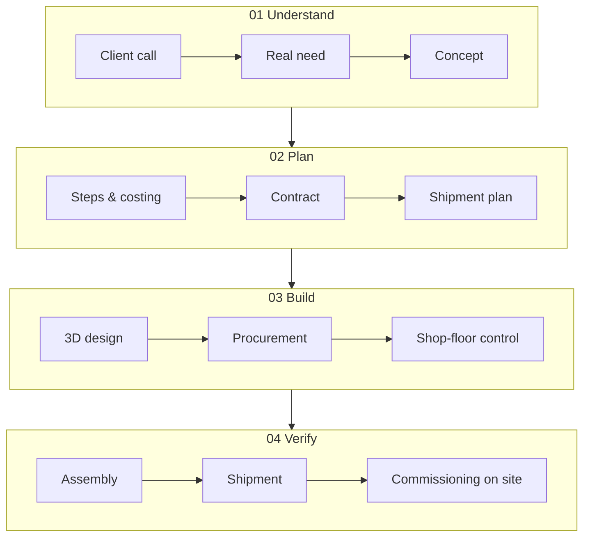

# 6 · Path — steel and silicon, always both

[Contents](../README.md) · [← 5 · Lab](05-lab.md) · Next: [7 · Vision →](07-vision.md)

> **In one line:** technology was always part of my work. Now it is the focus.
> On the site: [Path](https://homensai.com/path.html) · [Profile](https://homensai.com/profile.html)

---

Diplom-Systemingenieur. Twenty years designing machines, production lines and the logic that runs
them. Today — where software meets the physical world.

## Two worlds, one path

| When | World | What |
|------|-------|------|
| 1980s | Imagination | Science fiction: robots, new worlds, civilisations. |
| 1993 | Digital | Systems engineering at university · first AI in Lisp. |
| 1997 | Digital | PGP · distributed key cracking. |
| 2002 | Physical | **UViS Technologii** · founding team, engineering and sales · from 3 to ~35 people · CIS leader in cellular-concrete lines (2002–2005). |
| 2008 | Physical | **EKVIPTEH** · co-founder and director · team of 26 · custom machines · 1,000+ projects · exports to 7 countries. |
| 2010 | Both | Paper → 3D CAD. Clients saw the machine before it was built. |
| 2018 | Both | GPU rigs — hardware meets cryptography. |
| Today | Both | IT infrastructure and local AI in Germany. |

## The full loop — in steel

UViS and EKVIPTEH, 2002–2023: twenty-one years of the same full cycle. In my own words, this is
what one order looked like at EKVIPTEH:

> I ran the company directly, 26 people. I maintained the website myself. I took the customers'
> calls and found out what they needed — down to the concept and the task. I worked out how to
> implement it and broke it into steps. I explained it all to the customer. I calculated
> everything, estimated the cost so that the company made a profit. Then we agreed, signed the
> contract, received payment, and planned every stage of shipment — a complex project could ship
> in several stages. I gave tasks to the designers and they worked out the drawings. Then the
> materials were bought. I controlled the incoming materials and what was or was not in stock.
> With the head of the workshop I distributed the work, set deadlines, intensity, priorities and
> the customer's wishes, and then controlled it all; if there were difficulties, I helped solve
> them. I always went to the shop floor to see what was ready, what was not, what the problems
> were. Then it was assembled, paid, shipped, assembled again at the customer's site, and
> commissioning was controlled there. If there were questions, they were solved.

I delegated: task, deadline, resources, control — and stepped in only when needed. Today I
delegate to AI the same way.

## Numbers behind the story

| Figure | What |
|--------|------|
| 3 → ~35 | people in the team · UViS, 2002–2007 |
| ~$3M | UViS yearly turnover · 2007 |
| 26 | people · EKVIPTEH |
| 1,000+ | projects · 2008–2023 |
| ~$0.9M | EKVIPTEH peak year · 2012–13 |
| 7 | export countries |

*Rounded figures from my own records and project archive.*

## I write the logic. The programmer codes it.

| Step | What happens |
|------|--------------|
| 01 Client's idea | Sketched by hand together with the client. |
| 02 Logic | I write the algorithm: conditions, weights, doses, sequences. |
| 03 Sensors and controllers | Which sensors, which controllers to buy. |
| 04 Specification | Brief for the designers and the programmer. |
| 05 Code and build | The programmer codes and builds the controller; designers calculate and draw. |
| 06 Commissioning | Launch on site — until it runs. |

Look at steps 02–04 again: that is exactly what working with AI looks like today. The role did not
change. The executor did.

## Hardware and software — one rope

Mechanisms, controllers, code. Two strands I have been twisting together since 1993. The
**hardware** strand here is non-IT: machines, steel, production — not computer hardware. The
**software** strand is IT.

## Roots: what shaped the way I think

- **Science fiction.** Writers were visionaries. Almost everything they described will be built.
- **Ancient Rome.** Roads and aqueducts from 312 BC — built with the best tools of their time. I
  am amazed how people, using the technology available to them, achieved things that are hard to
  achieve even now.
- **Ciphers.** From Caesar to PGP. How letters were written in ancient Rome, Aesopian language,
  how information was hidden.

> Caesar cipher, shift −3: `LPDJLQDWLRQ` → ?
> *(The answer is in the [Glossary](glossary.md).)*

---

[Contents](../README.md) · [← 5 · Lab](05-lab.md) · Next: [7 · Vision →](07-vision.md)
