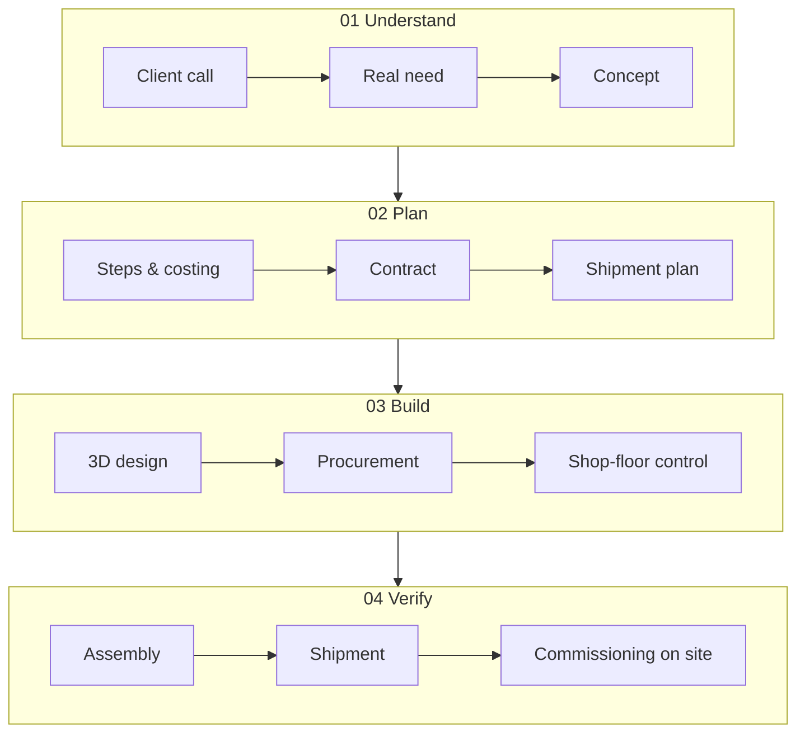

# 6 · Path — steel and silicon, always both

[Contents](../README.md) · [Deutsch](de/06-path.md) · [← 5 · Lab](05-lab.md) · Next: [7 · Vision →](07-vision.md)

> **In one line:** technology was always part of my work. Now it is the focus.
> On the site: [Path](https://homensai.com/path.html) · [Profile](https://homensai.com/profile.html)

---

Diplom-Systemingenieur. Twenty years building machines, production lines and the logic that runs
them. Today — where software meets the physical world.

## Two worlds, one path

| When | World | What |
|------|-------|------|
| 1980s | Imagination | Science fiction: robots, new worlds, civilisations. |
| 1993 | Digital | Systems engineering at university · first AI in Lisp. |
| 1997 | Digital | PGP · distributed key cracking. |
| 2002 | Physical | **UViS Technologii** · one of the three who started it, de facto founder, paid a salary (see below) · sales, calculations, contracts and project control · the team grew from 3 to about 35 people. |
| 2004 | Physical | At UViS Technologii I introduced 2D AutoCAD (I was not the designer). |
| 2008 | Physical | **EKVIPTEH** · co-founder and director · team of up to about 25 · custom machines · 1,000+ projects · exports to 7 countries. |
| 2010 | Both | At EKVIPTEH, paper drawings gave way to 3D CAD: SolidWorks, later Inventor (see below). Clients saw the machine before it was built. |
| 2018 | Both | GPU rigs — mechanics-and-code experience meets cryptography. |
| Today | Both | IT infrastructure and local AI in Germany. |

### When 3D came in

Three different things are easy to mix up here, so I keep them apart:

| What | When | Source |
|------|------|--------|
| I introduced 2D AutoCAD in the company (I was not the designer) | from 2004 | my own recollection |
| Paper drawings at EKVIPTEH when it started | 2008 | my own records |
| I introduced 3D at EKVIPTEH, with SolidWorks and later Inventor | 2010 | my own records |

The 2004 date is my recollection of when I introduced 2D AutoCAD; I did the introducing, not the
drawing. The step to 3D at EKVIPTEH in 2010 is described in
[Chapter 3](03-principles.md#on-p-03--never-postpone).

## The full loop — in steel

UViS Technologii and EKVIPTEH, 2002–2023: twenty-one years of the same full cycle. In my own words, this is
what one order looked like at EKVIPTEH:

> I ran the company directly, 25 people. I maintained the website myself. I took the customers'
> calls and found out what they needed — down to the concept and the task. I worked out how to
> implement it and broke it into steps. I explained it all to the customer. I calculated
> everything, estimated the cost so that the company made a profit. Then we agreed, signed the
> contract, received payment, and planned every stage of shipment — a complex project could ship
> in several stages. I gave tasks to the designers and they worked out the drawings. Then the
> materials were bought. I controlled the incoming materials and what was or was not in stock.
> With the head of the workshop I distributed the work, set deadlines, pace, priorities and
> the customer's wishes, and then controlled it all; if there were difficulties, I helped solve
> them. I always went to the shop floor to see what was ready, what was not, what the problems
> were. Then it was assembled, paid, shipped, assembled again at the customer's site, and
> commissioning was controlled there. If there were questions, they were solved.

Note what is personal and what is team work: the steps above are what **I** did or directly
controlled; the drawings, the machining, the assembly and the controller programming were done by
designers, workshop staff and a programmer.

I delegated: task, deadline, resources, control — and stepped in only when needed. Today I
delegate to AI the same way.

## Numbers behind the story

| Figure | What it measures | Period |
|--------|------------------|--------|
| 3 → about 35 | people in the team, UViS Technologii | 2002–2007 |
| about $3M | UViS Technologii yearly turnover, in the last year | 2007 |
| up to about 25 | people in the EKVIPTEH team, at the peak | peak years |
| up to about $0.9M | EKVIPTEH yearly turnover in its best years; other years roughly half | 2012–2013 |
| 1,000+ | project folders in the project archive, counted as projects | 2008–2023 |
| 7 | countries to which equipment was exported | 2008–2023 |

*Rounded figures from my own records and project archive: turnover, not profit; not audited.*

About the claim that UViS Technologii was a leader in cellular-concrete lines in the CIS in 2002–2005: this
is my own judgement, and it is subjective. At the time I knew of no comparable website in the CIS
with such detailed material and video, and the company supplied equipment around the world. I
cite no independent market ranking, so please read it as the author's account, not as a verified
fact.

About my role at UViS Technologii: I was one of the three people who started the company, and its name comes
from their first names. That was an oral arrangement; no document confirms that I was a founder,
although in practice I was one. I was paid a salary and had no influence over the company's
finances. Inside the company I worked in the office on marketing, calculations, contracts,
customer consulting and the link between office and shop floor.

## I define the control logic; the programmer implements it

| Step | What happens |
|------|--------------|
| 01 Client's idea | Sketched by hand together with the client. |
| 02 Logic | I write the algorithm: conditions, weights, doses, sequences. |
| 03 Sensors and controllers | Which sensors, which controllers to buy. |
| 04 Specification | Brief for the designers and the programmer. |
| 05 Code and build | The programmer codes and builds the controller; designers calculate and draw. |
| 06 Commissioning | Launch on site — until it runs. |

Look at steps 02–04 again: that is exactly what working with AI looks like today. The role did not
change. The executor did. I did not write the controller code myself; my part was the logic, the
specification and the check.

## Mechanics and software — two strands, one system

Mechanisms, controllers, code. Two strands I have been bringing together since 1993. The
**mechanical** strand is machines, steel, production — physical engineering, not computer
hardware. The **software** strand is IT.

My experience of robotics so far is automation of machines and production lines; work on robots
as such is the direction I am moving into, with local AI, rather than a completed project that
this book describes.

## Roots: what shaped the way I think

- **Science fiction.** Writers were visionaries. Many things they described were later worked on
  by engineers; I expect many more to be.
- **Ancient Rome.** Roads and aqueducts from 312 BC — built with the best tools of their time. I
  am amazed how people, using the technology available to them, achieved things that are hard to
  achieve even now.
- **Ciphers.** From Caesar to PGP. How letters were written in ancient Rome, Aesopian language,
  how information was hidden.

> Caesar cipher, shift −3: `LPDJLQDWLRQ` → ?
> *(The answer is in the [Glossary](glossary.md).)*

---

[Contents](../README.md) · [Deutsch](de/06-path.md) · [← 5 · Lab](05-lab.md) · Next: [7 · Vision →](07-vision.md)
