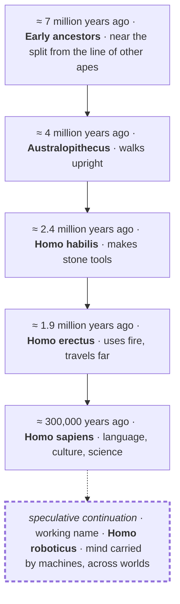

# 7 · Vision — life beyond Earth, carried by machines

[Contents](../README.md) · [Deutsch](de/07-vision.md) · [← 6 · Path](06-path.md) · Next: [8 · Field guide →](08-field-guide.md)

> **In one line:** robotics and AI are, in my belief, the next step — one possible way for life to reach the stars.
> On the site: [Vision](https://homensai.com/vision.html) (with an animation from today to the Galaxy)

---

Humanity has always dreamed of other worlds. This chapter is my personal view of how we might get
there. It is **speculative**: an illustration of an idea, not a forecast. Facts that can be checked
are marked with a source in [Notes and sources](notes.md#science-facts-used); beliefs and
scenarios are marked as such.

## The body is made for Earth. The machine is not.

| | | |
|---|---|---|
| **V-01 · Body** | **People are local.** | Gravity, air, water, a narrow range of temperature, protection from radiation. A human needs a piece of Earth to stay alive — and carries it along on every trip. |
| **V-02 · Machine** | **Machines can wait.** | A machine needs no air or food, and — if it is specially designed for it, with radiation-tolerant electronics and thermal control — it can work in vacuum and cold. It can be repaired, copied and, in principle, put into a low-power state for long periods. Ordinary robots are not built for this; special design is the condition. Distance and time stop being the main enemy. |
| **V-03 · Mind** | **AI makes them independent.** | A radio signal needs 3 to 22 minutes one way to reach Mars, depending on the positions of the planets. With such delays, real-time remote control is not possible: a machine must decide many things on its own — within rules and checks that we give it. Remote commands still work; they just cannot steer a machine second by second. |

## The line of development

My personal belief: ***Homo roboticus*** could be the next stage in the development of humankind —
one more step on a line that runs from early ancestors to us. Each step changed what a body could
do, or where a mind could live. This one may be among the last: the mind leaves the limits of
biology.

  

The last figure is the robot from my site: a chrome "TV-set" head, two antennas with a gold and a
teal ball, instrument eyes, and the gear-and-circuit mark on its chest — gold for the physical
world, teal for the digital one.

This is a **simplified illustration**, not a strict biological classification. Real human
evolution is a branching bush with overlapping species, not a straight line, and the dates are
approximate and depend on the finds and the definitions used. The dashed last step is not
science: it is the speculative continuation that this chapter is about.

## After Homo sapiens — what?

This is my personal opinion: today's AI and robotics are the next stage in the development of
*Homo sapiens*. **Not the end of people — the continuation of life by other means.**

| Today | → | Working name |
|-------|---|--------------|
| ***Homo sapiens*** — biology, one planet | → | ***Homo roboticus*** — mind, machines, many worlds |

There is no official name, and this is not a biological term — just a short way to say "the next
step". Related ideas by others: *mind children* (Hans Moravec, 1988) and self-replicating space
probes (the idea goes back to John von Neumann's work on self-reproducing automata). The phrase
"Homo roboticus" has also been used before by other authors; see
[Notes and sources](notes.md#prior-use-of-the-term-homo-roboticus). What I put forward here is my
own vision built around it.

## The finale: one possible path to interstellar travel

My personal belief: **one possible way** for a human being — as an individual — to travel through
the Universe is this. *If* consciousness can be transferred into a robot, a person becomes
*Homo roboticus*: the life of one mind need not end, and that mind can go anywhere. It is a
hypothetical scenario, not a proven or the only route; other routes, including slow
generation ships or biological adaptation, are conceivable.

| A person | → | Homo roboticus |
|----------|---|----------------|
| Mind in a brain — limited by one body and one lifetime | → | Mind in a machine — no biological limit, any world |

**An honest note:** today this is science fiction. Nobody knows whether it is possible, or whether
a transferred mind would still be the same person — the question is open (it is called *mind
uploading*). I treat it as the final point of the whole idea: a direction to think in, not a
promise.

## How it could unfold

An illustration, not a schedule.

| When | What |
|------|------|
| **Today** | Robotic spacecraft have reached places humans have not. Rovers drive on Mars; Voyager 1, launched in 1977, has been in interstellar space since 2012 and is still in contact with Earth (NASA; checked 5 October 2026). |
| **+100 years** | A scenario: robotic outposts. Robots might mine, build and repair on the Moon, on Mars and on asteroids long before — or instead of — people. |
| **+1,000 years** | A scenario: the solar system as a workshop. Planets and moons are reached; supply lines run on their own, under verified control. |
| **+10,000 … 1 million years** | A scenario: neighbouring stars. Slow, self-replicating probes build copies from local material and move on, star to star. |
| **+millions of years** | A scenario: the Galaxy. The Milky Way is roughly 100,000 light-years across; published estimates of how fast self-replicating probes could cross it are speculative and range up to many millions of years. What spreads is not metal — it is the curiosity and memory of life that began here. |

## Free the mind: the less routine, the more ideas

My own experience: the more I free my hands and my head from routine programming that eats time,
the more ideas come. The more I allow myself to dream and to think globally, the more things I can
actually bring to life that did not exist before.

Today AI is a very strong tool for implementing many imagined ideas that can be expressed as
digital code. Not only programs — also concepts, websites, diagrams and schematics, learning
materials. (This book is one example; see [Notes](notes.md#about-this-text).)

For anyone who wants to be first:

1. **Spend much of your time on breadth of vision.** It is the scarce resource now, not typing speed.
2. **Know your requirements and your checks.** You can only hand over — and check — what you can
   define and verify.
3. **Give the routine away, keep the verification.** Fast, but controlled.

> People dream. Machines go. And what travels is our curiosity.

## Join in

If such projects exist, I want to take part. This idea has interested me all my life. I would like
to work on space robotics, autonomous systems, off-world construction — or anything that brings it
closer.

What I bring: control logic for machines, project and team management, and a systems view — from
the idea to a machine that runs. Robotics integration is the direction I am moving into, and the
use I have in mind for those transferable skills; it is not yet a project I can show.

→ [Get in touch](https://homensai.com/contact.html) · [My profile](https://homensai.com/profile.html)

---

[Contents](../README.md) · [Deutsch](de/07-vision.md) · [← 6 · Path](06-path.md) · Next: [8 · Field guide →](08-field-guide.md)
