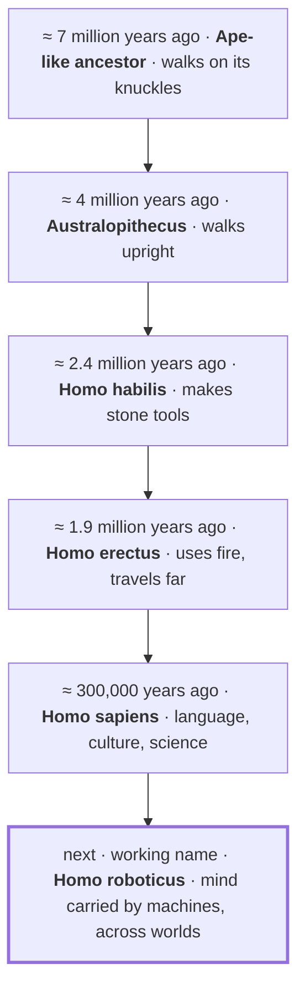

# 7 · Vision — life beyond Earth, carried by machines

[Contents](../README.md) · [← 6 · Path](06-path.md) · Next: [8 · Field guide →](08-field-guide.md)

> **In one line:** robotics and AI are the next step — the way life reaches the stars.
> On the site: [Vision](https://homensai.com/vision.html) (with an animation from today to the Galaxy)

---

Humanity has always dreamed of other worlds. This chapter is my personal view of how we get there.
It is an illustration of an idea, not a forecast.

## The body is made for Earth. The machine is not.

| | | |
|---|---|---|
| **V-01 · Body** | **People are local.** | Gravity, air, water, a narrow range of temperature, protection from radiation. A human needs a piece of Earth to stay alive — and carries it along on every trip. |
| **V-02 · Machine** | **Machines can wait.** | A robot needs no air or food, tolerates vacuum and cold, can be repaired, copied, even switched off for a century. Distance and time stop being the main enemy. |
| **V-03 · Mind** | **AI makes them independent.** | A radio signal needs 3 to 22 minutes one way to reach Mars; further out, remote control is impossible. Out there a machine must decide on its own — within rules and checks that we give it. |

## The line of development

My personal belief: ***Homo roboticus*** is the next stage in the development of humankind — one
more step on the line that runs from the first upright apes to us. Each step changed what a body
could do, or where a mind could live. This one may be among the last: the mind leaves the limits of
biology.

  

The last figure is the robot from my site: a chrome "TV-set" head, two antennas with a gold and a
teal ball, instrument eyes, and the gear-and-circuit mark on its chest — gold for the physical
world, teal for the digital one.

The dates are approximate. This is not a strict biological classification — it is a way of saying
that the line of development continues, and that its next step may not be made of flesh.

## After Homo sapiens — what?

This is my personal opinion: today's AI and robotics are the next stage in the development of
*Homo sapiens*. **Not the end of people — the continuation of life by other means.**

| Today | → | Working name |
|-------|---|--------------|
| ***Homo sapiens*** — biology, one planet | → | ***Homo roboticus*** — mind, machines, many worlds |

There is no official name, and this is not a biological term — just a short way to say "the next
step". Related ideas by others: *mind children* (Hans Moravec, 1988) and self-replicating space
probes (John von Neumann). The phrase "Homo roboticus" has also been used before by other authors;
see [Notes and sources](notes.md). What I put forward here is my own vision built around it.

## The finale: the one way a person himself can go

My personal belief: there is only one way for a human being — as an individual — to travel through
the Universe. If consciousness can be transferred into a robot, a person becomes *Homo roboticus*:
the life of one mind need not end, and that mind can go anywhere.

| A person | → | Homo roboticus |
|----------|---|----------------|
| Mind in a brain — limited by one body and one lifetime | → | Mind in a machine — no biological limit, any world |

**An honest note:** today this is science fiction. Nobody knows whether it is possible, or whether
a transferred mind would still be the same person — the question is open (it is called *mind
uploading*). I treat it as the final point of the whole idea: a direction to think in, not a
promise.

## How it could unfold

An illustration, not a schedule.

| When | What |
|------|------|
| **Today** | Machines already went where people cannot. Rovers drive on Mars; Voyager 1, launched in 1977, still sends signals from interstellar space. |
| **+100 years** | Robotic outposts. Robots mine, build and repair on the Moon, on Mars and on asteroids long before — or instead of — people. |
| **+1,000 years** | The solar system as a workshop. Planets and moons are reached; supply lines run on their own, under verified control. |
| **+10,000 … 1 million years** | Neighbouring stars. Slow, self-replicating probes build copies from local material and move on, star to star. |
| **+millions of years** | The Galaxy. The Milky Way is about 100,000 light-years across; even slow expansion could cross it in millions to tens of millions of years. What spreads is not metal — it is the curiosity and memory of life that began here. |

## Free the mind: the less routine, the more ideas

My own experience: the more I free my hands and my head from routine programming that eats time,
the more ideas come. The more I allow myself to dream and to think globally, the more things I can
actually bring to life that did not exist before.

Today AI is a very strong tool for implementing almost any imagined idea that can be expressed as
digital code. Not only programs — also concepts, websites, diagrams and schemes, learning
materials. (This book is one example.)

For anyone who wants to be first:

1. **Spend most of your time on breadth of vision.** It is the scarce resource now, not typing speed.
2. **Understand your own processes.** You can only hand over — and check — what you understand.
3. **Give the routine away, keep the verification.** Fast, but controlled.

> People dream. Machines go. And what travels is our curiosity.

## Join in

If such projects exist, I want to take part. This idea has interested me all my life. I am ready to
work on space robotics, autonomous systems, off-world construction — or anything that brings it
closer.

What I bring: control logic for machines, robotics integration, project and team management, and a
systems view — from the idea to a machine that runs.

→ [Get in touch](https://homensai.com/contact.html) · [My profile](https://homensai.com/profile.html)

---

[Contents](../README.md) · [← 6 · Path](06-path.md) · Next: [8 · Field guide →](08-field-guide.md)
