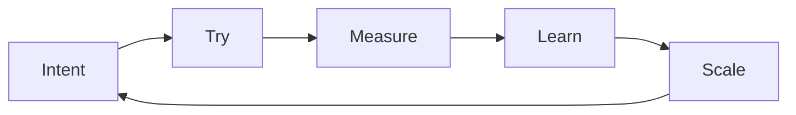

# 8 · Field guide — the method as checklists

[Contents](../README.md) · [Deutsch](de/08-field-guide.md) · [← 7 · Vision](07-vision.md) · Next: [Glossary →](glossary.md)

> **In one line:** the ideas of this book, turned into steps you can use on your own work tomorrow.

---

This chapter adds no new ideas. It takes the ones from chapters 2–6 and turns them into
checklists. Copy them, change them, use them. A complete, executed example that follows sections
1–4 from start to finish is in [examples/order-table](../examples/order-table/README.md); a
copyable form of the intent card is in [templates/intent-card.md](../templates/intent-card.md).

## 1. Before you start: the intent card

Write this on one page before you build anything — with people, with AI, or alone.

```text
INTENT CARD
-----------
What do I want?            (one sentence, no technical words)
Why?                       (what changes when it exists)
For whom?
What does "done" look like?   (a measurable check — weight, time, a number, a test)
What must NOT happen?      (safety, money, data, deadline)
What do I already know?    (data, drawings, examples, old projects)
What is uncertain?         (list it — that is where you start)
How will I check it?       (who or what verifies; what I need to understand to judge it)
```

If you cannot fill in **"what does done look like"** or **"how will I check it"**, you are not
ready to delegate yet — neither to a person nor to AI. AI reduces manual work; it does not remove
the need to understand the requirements, the constraints and how to verify the result.

## 2. Decompose: from "is it even possible?" to steps

From [Chapter 3 · Uncertainty](03-principles.md#uncertainty-start-with-doubt-finish-with-an-outcome).

- [ ] Write the big task in one line.
- [ ] Split it into 3–7 parts. Each part must have its own "done" check.
- [ ] Split each part again until every step fits into one working day.
- [ ] Mark the steps you do not know how to do. Do one of those **first** — that is where the doubt lives.
- [ ] Keep going step by step, and test each step against its check.
- [ ] If a step fails its check, choose one of three outcomes: **research** (find out more),
      **change the requirements** (scope, cost, time), or **stop** — and write down why.

Not every task can be done within its limits. A deliberate stop with a written reason is a good
result, not a failure of method.

## 3. Delegate like a director

From [Chapter 3 · P-05](03-principles.md#on-p-05--delegation). The same four parts for a person and
for AI:

| Part | For a person | For AI |
|------|--------------|--------|
| **Task** | What and why, in plain words | The intent card + examples of good output |
| **Deadline** | Date and checkpoints | Scope per run: one step, not the whole project |
| **Resources** | Budget, tools, access, people | Files, data, context — and nothing it does not need |
| **Control** | Checkpoints, visits to the shop floor | Tests, comparisons, second opinion, your own review |

Delegate only what you can define and verify. Step in only when it really matters — but
**always** do the control.

## 4. Verify like an engineer

From [Chapter 5 · Method](05-lab.md#method-not-done-until-verified).

- [ ] Is there a number, a test or a measurement that says it works?
- [ ] Did I check it on a real case — a real machine, a real document, a real customer?
- [ ] Did I check the edges — maximum load, empty input, wrong input?
- [ ] Is the failure written down too, with its number?
- [ ] Would I put my name to this result?

No result counts until it is checked.

## 5. Divide the work

From [Chapter 3 · Division of work](03-principles.md#division-of-work). Take one normal working week
and sort what you did:

| Goes to machines (with checks) | Stays with you |
|--------------------------------|----------------|
| Reports, paperwork | Ideas |
| Calculations, schedules | Decisions |
| Repeated checks | Responsibility |
| Data entry and lookup | Relationships and trust |
| Standard answers | Taste and meaning |

Hand over the left column one item at a time. Use the freed time for the right column — and for
**breadth of vision**.

## 6. Know where your data goes

Running a model on your own computer is not the same as proving that no data leaves. Check the
whole set-up, not only the model.

- [ ] Does this data include customers, contracts, money, personal details? If not, the rest of
      this list matters less.
- [ ] **Model:** where does it run — your machine, your server, or someone else's? Is the model
      file from a source you trust?
- [ ] **Tools and plug-ins:** does the tool, agent, browser extension or plug-in call web search,
      an API or a cloud service? Which ones are switched on?
- [ ] **Network:** for one test run, watch the outgoing connections (firewall log, router log or
      a packet capture on your own machine). Does anything go to an address you did not expect?
      Block outgoing traffic for the test machine and see whether the job still works.
- [ ] **Telemetry and updates:** do the model runner, the interface and the operating system send
      usage statistics or crash reports? Can you switch them off, and have you checked that they
      are off?
- [ ] **Logs and history:** where are prompts and answers stored? Who can read those files?
      How long are they kept?
- [ ] **Synchronisation and backups:** does a cloud drive, a notes app or a backup service copy
      the folders where the data, the logs or the chat history live?
- [ ] **Decision:** write down what leaves the building, if anything, and whether that is
      acceptable for this data. If you cannot say, treat the data as exposed and use a copy
      without the sensitive parts.

This checklist is a way to find out, not a guarantee. It does not replace a data-protection
review where the law requires one.

## 7. Test a new tool in one week

From [Chapter 3 · P-03, the best tools — today](03-principles.md#on-p-03--never-postpone) and the
[Lab](05-lab.md).

| Day | Do |
|-----|----|
| 1 | Write the question: *what should this tool do for me, and how will I measure it?* |
| 2 | Set it up on a small, real piece of your own work. |
| 3–4 | Run it. Measure. Write down what failed. |
| 5 | Compare with how you did it before: time, quality, cost. |
| 6 | Decide: keep, drop, or test again with a different set-up. |
| 7 | If you keep it — write a one-page note: how, when, with which checks. |

Do not trust it because it is new. Do not reject it because it is new. Test it.

## 8. Before AI influences a machine

For anything that moves, heats, cuts or switches. This is an outline, not a certification and not
an instruction for any particular machine; follow the standards, the manufacturer's documents and
a qualified safety assessment.

- [ ] **Requirements:** what the machine must and must not do; limits for speed, force,
      temperature; what "safe state" means; who can stop it and how.
- [ ] **Model or test bench:** run the logic first without real load and without people nearby.
- [ ] **Limited trial:** reduced speed, force or scope; a hardware stop within reach; someone
      watching; written pass criteria.
- [ ] **Controlled use:** monitoring, logs, a way back to the previous behaviour.
- [ ] After a failed stage, go back one stage — never forward.

## 9. The growth loop



Run it again with the next idea. When it works, every turn is faster than the last one.

---

[Contents](../README.md) · [Deutsch](de/08-field-guide.md) · [← 7 · Vision](07-vision.md) · Next: [Glossary →](glossary.md)
