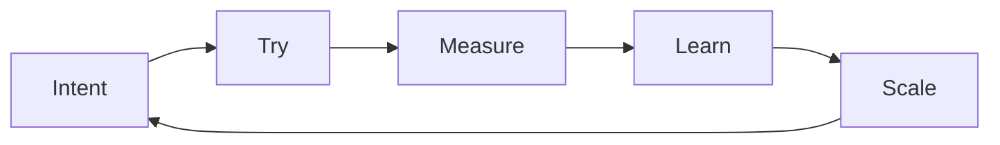

# 8 · Field guide — the method as checklists

[Contents](../README.md) · [← 7 · Vision](07-vision.md) · Next: [Glossary →](glossary.md)

> **In one line:** the ideas of this book, turned into steps you can use on your own work tomorrow.

---

This chapter adds no new ideas. It takes the ones from chapters 2–6 and turns them into
checklists. Copy them, change them, use them.

## 1. Before you start: the intent card

Write this on one page before you build anything — with people, with AI, or alone.

```text
INTENT CARD
-----------
What do I want?            (one sentence, no technical words)
Why?                       (what changes when it exists)
For whom?
What does "done" look like?   (a measurable check — weight, time, a number, a test)
What must NOT happen?      (safety, money, data, deadline)
What do I already know?    (data, drawings, examples, old projects)
What is uncertain?         (list it — that is where you start)
```

If you cannot fill in **"what does done look like"**, you are not ready to delegate yet — neither
to a person nor to AI.

## 2. Decompose: from "is it even possible?" to steps

From [Chapter 3 · Uncertainty](03-principles.md#uncertainty-start-with-doubt-finish-with-a-result).

- [ ] Write the big task in one line.
- [ ] Split it into 3–7 parts. Each part must have its own "done" check.
- [ ] Split each part again until every step fits into one working day.
- [ ] Mark the steps you do not know how to do. Do one of those **first** — that is where the doubt lives.
- [ ] Keep going step by step. Uncertainty is solved by consistent action, not by waiting.

## 3. Delegate like a director

From [Chapter 3 · P-05](03-principles.md#on-p-05--delegation). The same four parts for a person and
for AI:

| Part | For a person | For AI |
|------|--------------|--------|
| **Task** | What and why, in plain words | The intent card + examples of good output |
| **Deadline** | Date and checkpoints | Scope per run: one step, not the whole project |
| **Resources** | Budget, tools, access, people | Files, data, context — and nothing it does not need |
| **Control** | Checkpoints, visits to the shop floor | Tests, comparisons, second opinion, your own review |

Step in only when it really matters — but **always** do the control.

## 4. Verify like an engineer

From [Chapter 5 · Method](05-lab.md#method-not-done-until-verified).

- [ ] Is there a number, a test or a measurement that says it works?
- [ ] Did I check it on a real case — a real machine, a real document, a real customer?
- [ ] Did I check the edges — maximum load, empty input, wrong input?
- [ ] Is the failure written down too, with its number?
- [ ] Would I sign under this result with my name?

No result counts until it is checked.

## 5. Divide the work

From [Chapter 3 · Division of work](03-principles.md#division-of-work). Take one normal working week
and sort what you did:

| Goes to machines (with checks) | Stays with you |
|--------------------------------|----------------|
| Reports, paperwork | Ideas |
| Calculations, schedules | Decisions |
| Repeated checks | Responsibility |
| Data entry and lookup | Relationships and trust |
| Standard answers | Taste and meaning |

Hand over the left column one item at a time. Use the freed time for the right column — and for
**breadth of vision**.

## 6. Keep the data at home

- [ ] Does this data include customers, contracts, money, personal details?
- [ ] If yes — can a local model do the job? (Often it can.)
- [ ] If not — what exactly leaves the building, and is that acceptable?

## 7. Test a new tool in one week

From [Chapter 2 · The best tools — today](02-manifesto.md) and the [Lab](05-lab.md).

| Day | Do |
|-----|----|
| 1 | Write the question: *what should this tool do for me, and how will I measure it?* |
| 2 | Set it up on a small, real piece of your own work. |
| 3–4 | Run it. Measure. Write down what failed. |
| 5 | Compare with how you did it before: time, quality, cost. |
| 6 | Decide: keep, drop, or test again with a different set-up. |
| 7 | If you keep it — write a one-page note: how, when, with which checks. |

Do not trust it because it is new. Do not reject it because it is new. Test it.

## 8. The growth loop



Run it again with the next idea. Every turn should be faster than the last one.

---

[Contents](../README.md) · [← 7 · Vision](07-vision.md) · Next: [Glossary →](glossary.md)
