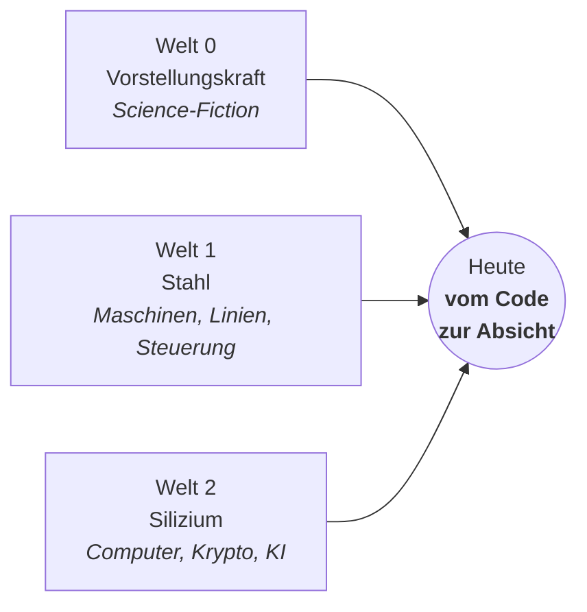
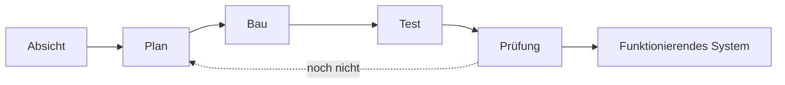

# 1 · Drei Welten

[Inhalt](../../README.de.md) · [English](../01-three-worlds.md) · [← 0 · Vorwort](00-preface.md) · Weiter: [2 · Manifest →](02-manifesto.md)

> **In einer Zeile:** Vorstellungskraft, Maschinen und Code — drei Welten führten mich an denselben Ort: vom Code zur Absicht.
> Auf der Website: [homensai.com](https://homensai.com/)

---

## Welt 0 · Märchen, Bücher und Science-Fiction

Vor jeder Maschine und jedem Computer gab es Bücher. Mit dreizehn oder vierzehn Jahren las ich
jedes Science-Fiction-Buch, das ich finden konnte: Roboter, denkende Maschinen, neue Welten,
Zivilisationen. Das hat meine Denkweise stärker geprägt als alles andere.

Die Vorstellungskraft kam zuerst. Alles andere war ein Weg, ihr näherzukommen.

## Welt 1 · Die mechanische Welt, seit 2002

Schlüsselfertig gebaute Produktionslinien. Maschinen und Mechanismen. Steuerungen und Rechner, die
sie betreiben. Und fast immer Einzelanfertigung: Der Kunde brachte eine Idee, wir brachten die
Umsetzung.

Wir bauten ständig neue Anlagen, und ich versuchte immer, sie zu verbessern — schöner, technisch
fortschrittlicher, einfacher. Es war die Welt einer Zeit, in der der Maschinenbau die Wirtschaft
anführte.

## Welt 2 · Die digitale Welt, seit 1991

Computer seit der Schulzeit. Dann, Schritt für Schritt (die Tabelle zeigt, wann jeder Schritt
begann; einige überschneiden sich):

| Jahre | Was |
|-------|-----|
| 1993–1998 | Systemtechnik an der Universität; erste Schritte mit KI, in Lisp |
| 1997–1998 | Public-Key-Kryptografie (PGP); verteiltes Schlüsselknacken |
| ab 2004 | Computergestütztes Konstruieren — ich führte 2D-AutoCAD im Unternehmen ein (ich war nicht der Konstrukteur); 3D mit SolidWorks kam 2010, siehe [Kapitel 6](06-path.md#wann-3d-kam) |
| ab 2018 | GPU-Rigs, Kryptowährung |
| ab 2023 | KI als alltägliches Arbeitswerkzeug; lokales KI-Labor |

## Wo sie sich treffen

Den größten Teil meines Lebens habe ich in beiden Welten zugleich gelebt. Reine Mechanik oder reiner
Code haben mich nie gefesselt. Der interessante Teil — und die größere Chance — beginnt dort, wo
sich beide treffen.

## Der Wandel: vom Code zur Absicht

Früher standen zwischen einer Idee und einem funktionierenden System Codezeilen — Tausende, von Hand
geschrieben. Jetzt gibt es eine neue Schicht: Sie formulieren die **Absicht**, und Werkzeuge helfen
beim Planen, Bauen und Testen.

Der Code verschwindet nicht. Er rutscht eine Ebene tiefer — so wie der Maschinencode vor Jahrzehnten
unter die Hochsprachen rutschte. Nach oben rückt der menschliche Teil: wissen, was man will, und
prüfen können, ob man es bekommen hat. Beachten Sie den Pfeil zurück von der *Prüfung*: Ein Ergebnis,
das die Prüfung nicht besteht, geht zurück in den Plan — oder endet, wie
[Kapitel 3](03-principles.md#ungewissheit-mit-zweifel-beginnen-mit-einem-ergebnis-enden) zeigt,
mit geänderten Anforderungen oder der Entscheidung aufzuhören.

---

[Inhalt](../../README.de.md) · [English](../01-three-worlds.md) · [← 0 · Vorwort](00-preface.md) · Weiter: [2 · Manifest →](02-manifesto.md)
