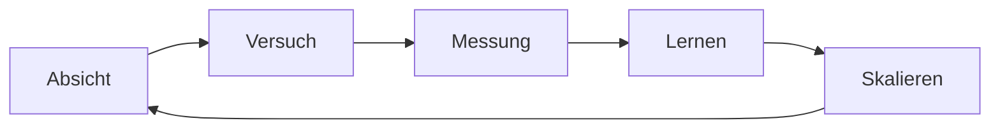

# 2 · Manifest — Weiter denken. Schneller bauen.

[Inhalt](../../README.de.md) · [English](../02-manifesto.md) · [← 1 · Drei Welten](01-three-worlds.md) · Weiter: [3 · Prinzipien →](03-principles.md)

> **In einer Zeile:** Ergebnisse hängen weniger von Details ab und mehr von der Weite des Blicks dahinter.
> Auf der Website: [Manifest](https://homensai.com/manifesto.html)

---

## Wir betreten eine Welt der Vorstellungskraft

Die Gegenwart sehe ich nicht als Gelegenheit, altes Wissen anzuwenden, sondern als Beginn einer Welt
neuer Möglichkeiten. In dieser Welt hängt es vom Menschen ab, ob aus einer Idee Wirklichkeit wird:
von der Weite seines Blicks, von Vorstellungskraft und systemischem Denken und vor allem von der
Qualität der Idee.

KI kann den Umfang routinemäßiger Umsetzungsarbeit verringern, den wir von Hand leisten. Sie nimmt
uns nicht die Notwendigkeit ab, Anforderungen, Randbedingungen und die Art der Ergebnisprüfung zu
verstehen. Was schrumpft, ist die manuelle Arbeit an kleinen Aufgaben; was bleibt, ist das
Verständnis, mit dem man sagen kann, was man will, und erkennt, ob man es bekommen hat.

## Wachstum ist ein Kreislauf, keine Linie

Wenn es funktioniert, ist jede Runde des Kreislaufs schneller als die vorige, weil die Werkzeuge
besser werden und weil Sie besser werden. Wachstum ist keine gerade Straße; es sind dieselben fünf
Schritte, immer wieder.

## Das Schwierigste ist die Idee

Etwas zu erfinden ist der schwierige Teil. Das Bauen ist viel einfacher geworden.

Den größten Teil der Geschichte standen Jahre, Fachleute, Teams, Budgets und Genehmigungen zwischen
einer Idee und ihrer Verwirklichung. Moderne Werkzeuge beseitigen einen großen Teil dieser
Entfernung. Was bleibt, ist die Idee selbst — und die Arbeit, zu prüfen, ob sie sich umsetzen lässt.

> „Vorstellungskraft ist wichtiger als Wissen.“ — Albert Einstein
> (siehe [Anmerkungen und Quellen](notes.md#zitat-und-quellen))
>
> Für das Bauen von Dingen ist sie auch ein praktischer Vorteil.

Sie müssen kein enger Spezialist mehr sein, um mit dem Bauen Ihrer Idee zu beginnen. Sie brauchen
eine weite und tiefe Vorstellungskraft — und die Disziplin, sie an der Wirklichkeit zu prüfen.

Drei Folgen:

- **Ideen sind knapp.** Erfinden ist der schwierige Teil.
- **Werkzeuge erweitern unsere Möglichkeiten.** Moderne Werkzeuge abzulehnen heißt, auf einen großen
  Vorteil zu verzichten.
- **Träume halten uns ganz.** Nach meiner eigenen Erfahrung gehört es zum Wohlbefinden, die eigenen
  Pläne zu verwirklichen. Das ist eine persönliche Beobachtung, keine medizinische Aussage.

## Science-Fiction als Quelle von Spezifikationen

Science-Fiction-Autoren waren nicht nur Träumer. Viele waren Visionäre: Sie beschrieben Maschinen und
Situationen, an denen Ingenieure später arbeiteten. Ich glaube, dass viele dieser Ideen in der einen
oder anderen Form gebaut werden — doch jede von ihnen muss die Prüfungen von Physik, Technik und
Kosten bestehen ([Kapitel 3](03-principles.md#machbarkeit-wird-geprüft-nicht-vorausgesetzt)).

## Dasselbe Geschäft. Neues Team.

Menschen entscheiden. KI führt aus. Jedes Ergebnis wird geprüft.

Zwanzig Jahre lang habe ich denselben Auftragszyklus durchlaufen: verstehen, planen, bauen, prüfen.
2008 wurde jeder Schritt von Menschen erledigt. Heute kann ein großer Teil davon von KI erledigt
werden — nicht aber das Entscheiden und nicht das handwerkliche Können.

| Phase | 2008 · Menschen | Heute |
|-------|-----------------|-------|
| 01 Verstehen — Kundengespräch, echter Bedarf, Konzept | Mensch | **Mensch entscheidet**, KI hilft bei der Vorbereitung |
| 02 Planen — Schritte und Kalkulation, Vertrag, Versandplan | Mensch | **KI führt aus**, Mensch genehmigt |
| 03 Bauen — 3D-Konstruktion, Beschaffung, Steuerung der Werkstatt | Mensch | KI erledigt die Routine, **Hände und Können** in der Werkstatt |
| 04 Prüfen — Montage, Versand, Inbetriebnahme | Mensch | **Mensch entscheidet**, Hände und Können vor Ort |

Drei Regeln machen das möglich:

1. **Delegieren wie ein Direktor.** Aufgabe, Termin, Ressourcen, Kontrolle — an Menschen und an KI.
2. **Prüfen wie ein Ingenieur.** Kein Ergebnis zählt, bevor es geprüft ist.
3. **Wissen, wohin die Daten gehen.** Arbeit mit sensiblen Daten lässt sich vielleicht besser mit
   lokaler KI erledigen, aber ein lokal laufendes Modell hält Daten für sich allein noch nicht lokal
   ([Praxisleitfaden, Abschnitt 6](08-field-guide.md#6-wissen-wohin-ihre-daten-gehen)).

## Die Welt beschleunigt sich

Die Welt wird schneller, ob wir wollen oder nicht. Wer neue Werkzeuge nicht testen will, kann
zurückfallen; wer testet, ausprobiert und — mit Sorgfalt — umsetzt, hat einen Vorteil. Sich an das
Ruder eines sinkenden Bootes zu klammern ist keine Strategie.

Setzen Sie so schnell um, wie Sie prüfen können: ständig testen und kontrollieren.

> Alles um uns herum ist ein Konzept. Sind Sie bereit, es in der Praxis zu testen? Ihr Erfolg hängt
> davon ab.

---

[Inhalt](../../README.de.md) · [English](../02-manifesto.md) · [← 1 · Drei Welten](01-three-worlds.md) · Weiter: [3 · Prinzipien →](03-principles.md)
