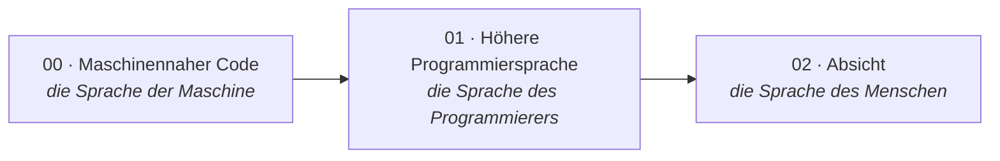
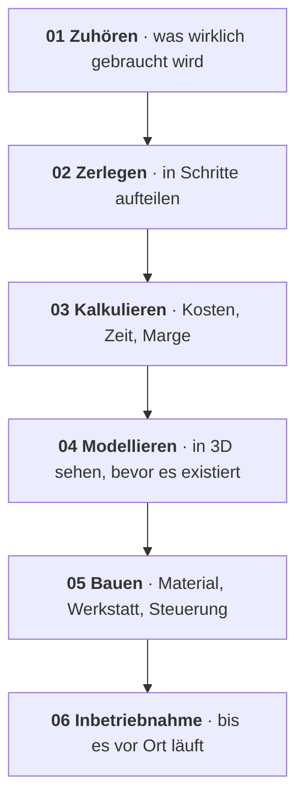
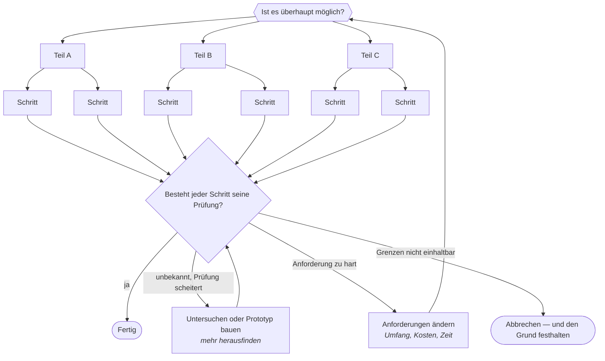

# 3 · Prinzipien — vom Programmieren zum philosophischen Management

[Inhalt](../../README.de.md) · [English](../03-principles.md) · [← 2 · Manifest](02-manifesto.md) · Weiter: [4 · Physische KI →](04-physical-ai.md)

> **In einer Zeile:** wie ich denke, entscheide und baue.
> Auf der Website: [Konzept](https://homensai.com/concept.html)

---

## Der Wandel

Ich glaube, unsere Welt bewegt sich vom Programmieren auf niedriger und hoher Ebene und vom
Konstruieren hin zu einem Bereich, den ich **philosophisches Management** nenne. Das ist mein
eigener Name dafür, keine anerkannte Stufe in der Geschichte des Programmierens: Gemeint ist, Arbeit
über Absicht, Ideen und Urteilskraft zu steuern statt über Code — und das Ergebnis dennoch prüfen zu
können.

Kleine Aufgaben zählen jedes Jahr weniger. Ergebnisse hängen stärker von der Weite des Blicks, von
Urteilskraft und Vorstellungskraft ab — und von der Fähigkeit, das Gebaute zu prüfen. Viele der
verbleibenden Grenzen sind unsere eigenen, aber nicht alle: Die anderen setzen Physik, Kosten und
Zeit.

## Sechs Prinzipien

| # | Prinzip | Was es bedeutet |
|---|---------|-----------------|
| P-01 | **Vorstellungskraft zuerst** | Das Schwierigste ist die Idee. Eine Idee ist ein Anfang; ob sie machbar ist, muss geprüft werden. |
| P-02 | **Alles ist ein Konzept** | Die einzige Frage: Sind Sie bereit, es in der Praxis zu testen? |
| P-03 | **Die besten Werkzeuge — heute** | Nutzen Sie die fortschrittlichsten Werkzeuge in Reichweite. Sobald Sie eine Idee hören: anfangen zu bauen und früh testen. |
| P-04 | **Schnell, aber geprüft** | Setzen Sie zügig um — mit Kontrolle, Tests und ständigen Prüfungen. |
| P-05 | **Delegieren** | Aufgabe, Termin, Ressourcen, Kontrolle. Eingreifen, wenn es wirklich darauf ankommt. |
| P-06 | **Experimentator** | Kein Institut nötig: Neugier, Versuche, gemessene Ergebnisse. |

### Zu P-03 — niemals aufschieben

Als meine Firma EKVIPTEH 2008 startete, zeichnete unser Konstrukteur auf Papier. Ich verstand, dass
das eine Sackgasse war. Sobald wir einen Konstrukteur hatten, der in 3D modellieren konnte, führte ich
es sofort ein — zuerst SolidWorks, dann Autodesk Inventor, nachdem ich gehört hatte, dass die
Konstruktionsbüros großer Werke damit arbeiteten. Ich kaufte dafür einen leistungsstarken Rechner und
Grafikkarten. Ab 2010 modellierte das Unternehmen in 3D. (2D-AutoCAD hatte ich schon früher, 2004,
eingeführt; siehe die [Zeitübersicht in Kapitel 6](06-path.md#wann-3d-kam).)

Für den Kunden änderte das alles: Aus seinem technischen Lastenheft bekam er schnell eine Zeichnung
und sah, was er erhalten würde — statt mündlicher Erklärungen und grober Skizzen. Korrekturen wurden
sofort gemacht.

Ich schiebe nie auf. Ich höre eine Idee — und versuche, sie sofort umzusetzen, zunächst in einem
kleinen Test.

### Zu P-05 — Delegieren

Ich habe immer delegiert. Ich habe das delegiert, was ich gut genug verstand, um die Aufgabe zu
definieren und das Ergebnis zu prüfen, und was ich anderen anvertrauen konnte. Ich gab die Aufgabe,
setzte den Termin, stellte die Ressourcen bereit und verfolgte den Fortschritt; ich half bei Fragen
und griff nur in Extremfällen ein. Das war der Kern meiner gesamten Arbeit im Unternehmen. Heute
delegiere ich an KI auf dieselbe Weise — und es gilt dieselbe Grenze: **Ich delegiere nur, was ich
definieren und prüfen kann.** Arbeit, die ich nicht beurteilen kann, gebe ich nicht blind ab; ich
lerne entweder genug, um sie zu prüfen, oder ich hole jemanden, der es kann.

### Zu P-06 — der Experimentator

Ich zähle mich zu den Experimentatoren: Menschen, die, ohne an einer Universität oder einem Institut
zu sein, aus ganzem Herzen alles Neue lernen und die Welt um sich herum verstehen wollen. Wenn Sie
Vorstellungskraft haben und den Wunsch auszuprobieren und zu lernen — wirklich zu lernen —, müssen Sie
sich nicht zuerst durch überholte akademische Routinen kämpfen. Nach meiner Erfahrung steigert das
Produktivität, Ergebnisse und Qualität.

## Machbarkeit wird geprüft, nicht vorausgesetzt

Eine Idee ist ein Anfang. Ob sie sich bauen lässt, muss an physikalischen, technischen und
ressourcenbezogenen Grenzen geprüft werden: Gewicht, Wärme, Zeit, Geld, Sicherheit, vorhandenes
Wissen. Eine Aufgabe in Schritte zu zerlegen hilft herauszufinden, *ob* sie machbar ist; es beweist
nicht, dass jede Aufgabe machbar ist.

## Arbeitsteilung

**Routine geht an Maschinen. Menschen widmen sich dem, was nur Menschen können.**

Jeder Routinevorgang — mit Prüfungen und Kontrolle — sollte so weit wie möglich abgegeben werden.
Menschliche Zeit gehört dem, was wichtiger und wertvoller ist: den Dingen, die nur ein Mensch
hervorbringen kann.

| Routine · automatisiert, geprüft | Menschen · nur Menschen |
|----------------------------------|-------------------------|
| Berichte und Schreibarbeit | Ideen und Vorstellungskraft |
| Berechnungen und Terminpläne | Urteilskraft und Entscheidungen |
| Wiederholte Prüfungen | Verantwortung |
| Dateneingabe und Recherche | Vertrauen und Beziehungen |
| Standardantworten | Geschmack und Bedeutung |

Die Abgabe der Routine **schafft Zeit**. Sie befreit nicht von der Verantwortung — die Kontrolle bleibt
bei Ihnen.

## Methode: von der Idee zur Inbetriebnahme

## Ungewissheit: mit Zweifel beginnen, mit einem Ergebnis enden

Einige Projekte habe ich begonnen, ohne sicher zu sein, dass sie überhaupt möglich waren. Jedes Mal
tat ich dasselbe: Ich zerlegte die große Aufgabe in kleinere, fand heraus, welche Teile unbekannt
waren, und testete diese zuerst — Schritt für Schritt.

Ungewissheit am Anfang ist kein Grund aufzugeben. Man arbeitet sie durch beharrliches Handeln und
durch Tests ab. Projekte, die ich so begonnen habe, wurden abgeschlossen — das ist meine Erfahrung,
keine Garantie. Eine Aufgabe kann sich innerhalb der Grenzen von Physik, Sicherheit, Budget oder
Zeit als unmöglich erweisen. Dann ist das richtige Ergebnis nicht „Fertig“, sondern eine geänderte
Anforderung, weitere Untersuchung oder ein bewusster Abbruch mit schriftlich festgehaltenem Grund.

> Jetzt ist die Zeit, in der Technologie zu Magie wird. Und man kann nicht mehr sagen, was zuerst da war.

---

[Inhalt](../../README.de.md) · [English](../03-principles.md) · [← 2 · Manifest](02-manifesto.md) · Weiter: [4 · Physische KI →](04-physical-ai.md)
