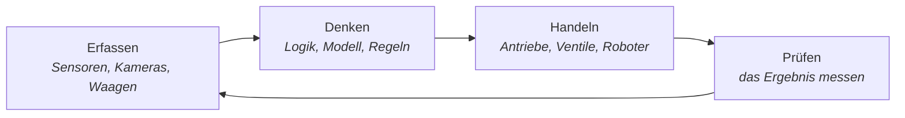
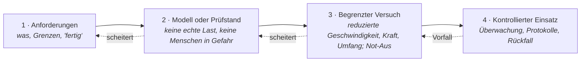

# 4 · Physische KI — KI in der physischen Welt testen

[Inhalt](../../README.de.md) · [English](../04-physical-ai.md) · [← 3 · Prinzipien](03-principles.md) · Weiter: [5 · Labor →](05-lab.md)

> **In einer Zeile:** unsere Welt und die Welt der KI treffen sich in Maschinen — dort wird KI wirklich getestet.
> Auf der Website: [Konzept](https://homensai.com/concept.html) · [Startseite](https://homensai.com/)

---

## Zwei physische Welten

Fehler der KI können reale Folgen haben, auch wenn das Ergebnis ein Text ist: Eine Spezifikation,
eine Vertragsklausel, eine Berechnung oder ein Befehl können zu einer Entscheidung werden. Wenn KI
physische Ausrüstung beeinflusst — ein Ventil, einen Roboterarm, eine CNC-Spindel —, muss das Testen
auch das Verhalten und die Grenzen der Maschine berücksichtigen. Dort kann ein Fehler Material, Zeit,
Geld kosten — manchmal die Sicherheit.

Hier treffen sich zwei physische Welten:

| Unsere physische Welt — wo wir leben und arbeiten | Die physische Welt der KI — wie KI unsere berührt |
|---------------------------------------------------|----------------------------------------------------|
| Werkstätten, Fabriken, Lager | Roboter und Manipulatoren |
| Büros, Wohnungen, Straßen | Antriebe, Ventile, CNC-Maschinen |
| Menschen, Zeitpläne, Geld | Sensoren, Kameras, Waagen |
| Reale Grenzen: Gewicht, Wärme, Zeit, Sicherheit | Erfasste und analysierte Daten |

Die Idee ist, an der Kante der neuesten Entwicklungen zu stehen — Robotersysteme, Datenerfassung und
-analyse — und in der Praxis zu prüfen, was wirklich funktioniert.

## Der Regelkreis

Jede Maschine, die ich je gebaut habe, lief nach demselben Kreislauf. KI ändert den Kreislauf nicht;
sie ändert, wer daran teilnehmen kann.

Der vierte Schritt ist der, den man vergisst. In der physischen Welt ist **Prüfen** nicht optional:
Das Gemisch hat das richtige Gewicht oder nicht; das Teil liegt in der Toleranz oder ist Ausschuss.

## Von der Idee zur laufenden Maschine: ein gestuftes Vorgehen

Der erste Test einer von KI beeinflussten Maschine sollte nicht an der laufenden Maschine stattfinden.
Die Reihenfolge, der ich folgen würde:

Jede Stufe hat ihre eigenen Bestehenskriterien, und ein Scheitern schickt Sie eine Stufe zurück, nicht
vorwärts. Dies ist ein redaktioneller Entwurf einer Methode, **keine ingenieurtechnische Zertifizierung
und keine fertige Anleitung zum Starten einer bestimmten Maschine**. Bei realer Ausrüstung kommen die
geltenden Normen, die Herstellerunterlagen und eine qualifizierte Sicherheitsbeurteilung zuerst.

## Warum mein Hintergrund hier passt

Zwanzig Jahre lang habe ich die Logik von Maschinen von Hand geschrieben: Bedingungen, Gewichte,
Dosierungen, Abläufe — welche Sensoren Füllstand und Gewicht messen, welche Steuerungen zu kaufen
sind, in welcher Reihenfolge die Dosierung läuft. Ein Programmierer machte aus meiner Logik
Steuerungscode. (Mehr dazu in [Kapitel 6](06-path.md).)

Das ist genau die Fähigkeit, die KI heute von Menschen braucht: die Absicht präzise beschreiben,
Regeln und Prüfungen festlegen und das Ergebnis prüfen — zuerst an einem Modell oder Prüfstand, dann
an der echten Maschine.

## Ein praktischer Ansatz

Das ist keine Vorhersage und kein Verkaufsgespräch. Es ist ein praktischer Ansatz:

1. **Testen Sie — in Stufen, und an einer echten Maschine erst, wenn die früheren Stufen bestanden sind.**
2. **Messen.**
3. **Behalten, was sich bewährt.**

> Die Welt beschleunigt sich. Testen, anpassen, umsetzen — nicht am Ruder eines sinkenden Bootes festhalten.

---

[Inhalt](../../README.de.md) · [English](../04-physical-ai.md) · [← 3 · Prinzipien](03-principles.md) · Weiter: [5 · Labor →](05-lab.md)
