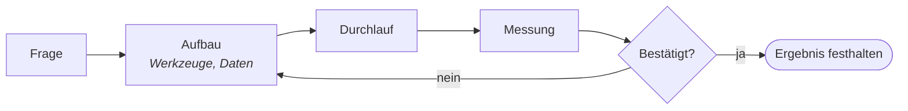

# 5 · Labor — Nicht glauben, weil es neu ist. Testen.

[Inhalt](../../README.de.md) · [English](../05-lab.md) · [← 4 · Physische KI](04-physical-ai.md) · Weiter: [6 · Weg →](06-path.md)

> **In einer Zeile:** Jedes Experiment ist eine Frage, ein Test und ein gemessenes Ergebnis — auch das, was gescheitert ist.
> Auf der Website: [Labor](https://homensai.com/lab.html)

---

## Methode: erst fertig, wenn geprüft

Vertrauen Sie einer Technologie nicht, nur weil sie neu ist. Lehnen Sie sie nicht aus demselben Grund
ab. Testen Sie sie selbst.

Auch gescheiterte Ergebnisse werden aufgeschrieben. Ein Misserfolg mit einer Zahl ist mehr wert als
ein Erfolg ohne Zahl.

## Aktuelle Experimente

| ID | Experiment | Frage | Werkzeuge | Ergebnis / Stand |
|----|------------|-------|-----------|------------------|
| EXP-001 | **Persönliches KI-Labor** — ein lokaler Inferenzserver | Kann eine einzelne Consumer-GPU ein ganzes lokales Netz mit KI-Modellen versorgen, wobei die Daten unter meiner Kontrolle bleiben? | RTX 3080, Docker, llama.cpp, Ollama, Open WebUI | *Vom Autor berichtet; Angaben zur Reproduzierbarkeit stehen noch aus.* Qwen 3.5 9B stabil bei 64k Kontext im LAN; 262k Kontext passte nicht in den VRAM. Protokoll und offene Felder: [EXP-001](../../experiments/EXP-001.de.md). |
| EXP-002 | **Benchmark-Labor** — welches Modell für welche GPU | Welches lokale Modell liefert die beste Qualität pro Gigabyte VRAM? | Qwen, Gemma, MiniCPM, GGUF | *In Arbeit.* Bericht in Vorbereitung. |
| EXP-003 | **Archiv-Analyse** — lokale KI liest 30.000 Projektdateien | Kann ein lokales Modell ein altes Vertragsarchiv in eine Tabelle aus Projekten, Beträgen und Jahren verwandeln, ohne etwas nach außen zu senden? | Ollama, Python, LibreOffice | *Geplant.* Erster Lauf mit meinem EKVIPTEH-Archiv. Ein kleiner synthetischer Ersatz steht im [durchgerechneten Beispiel](../../examples/order-table/README.de.md). |
| EXP-004 | **Heim-Lernportal** — ein lokaler KI-Tutor | Kann ein lokales Modell mit einer persönlichen Wissensbasis neue Fähigkeiten im eigenen Tempo vermitteln? | Obsidian, Ollama, Open WebUI | *Geplant.* |

Die Zahlen aus EXP-001 sind mein eigener Bericht aus einem laufenden Aufbau. Sie sind noch nicht durch
ein veröffentlichtes Messprotokoll belegt: Modelldatei, Quantisierung, Backend, Startparameter und
Messwerte sind im Protokoll als offen aufgeführt. Solange sie nicht eingetragen sind, behandeln Sie
das Ergebnis als berichtet, nicht als reproduziert.

Warum lokal? Wegen der dritten Regel aus dem [Manifest](02-manifesto.md): **wissen, wohin die Daten
gehen.** Lokale KI bedeutet, Modelle auf Hardware zu betreiben, die Sie kontrollieren. Ob Daten wirklich
lokal bleiben, hängt von der gesamten Konfiguration ab — Werkzeuge, Netzwerkzugriff, Protokollierung
und Sicherungen. Ein Vertragsarchiv, Kundenlisten, persönliche Notizen: Bevor sie einem Werkzeug
übergeben werden, prüfen Sie die Datenflüsse
([Praxisleitfaden, Abschnitt 6](08-field-guide.md#6-wissen-wohin-ihre-daten-gehen)). Dieses Buch
prüft die Datenflüsse keines bestimmten Produkts und macht dazu keine Aussagen.

## Archiv: dieselbe Neugier, dreißig Jahre

| ID | Wann | Was |
|----|------|-----|
| ARC-00 | Ebene 0 | **Science-Fiction.** Bücher über KI und Roboter. Lange vor dem Code begegnete ich ihnen auf Papier. |
| ARC-01 | 1990er | **Erste Schritte mit KI, in Lisp.** Ein Universitätskurs „Grundlagen der KI“: ein Programm, das aus den Antworten des Benutzers ein Insekt erriet. |
| ARC-02 | 1997–1998 | **Public-Key-Kryptografie und verteiltes Schlüsselknacken.** PGP; dann ein Experiment, bei dem Tausende Computer jeweils ein Stück eines Schlüssels per Brute Force probierten und das Ergebnis zurücksandten. Ich sehe darin den Anfang der Idee hinter dem Krypto-Mining. |
| ARC-03 | ab 2018 | **GPU-Mining-Rigs.** Strom, Kühlung, 24/7-Stabilität. Heute läuft auf derselben Art Hardware meine lokale KI. |
| ARC-04 | Heute | **KI, tiefer Einstieg.** Lokale Modelle, Agenten, Orchestrierung. KI ist heute mein alltägliches Arbeitswerkzeug. |

Die Linie durch alles ist dieselbe: eine Frage, eine Maschine und der Wunsch, mit eigenen Augen zu
sehen, ob es funktioniert.

---

[Inhalt](../../README.de.md) · [English](../05-lab.md) · [← 4 · Physische KI](04-physical-ai.md) · Weiter: [6 · Weg →](06-path.md)
