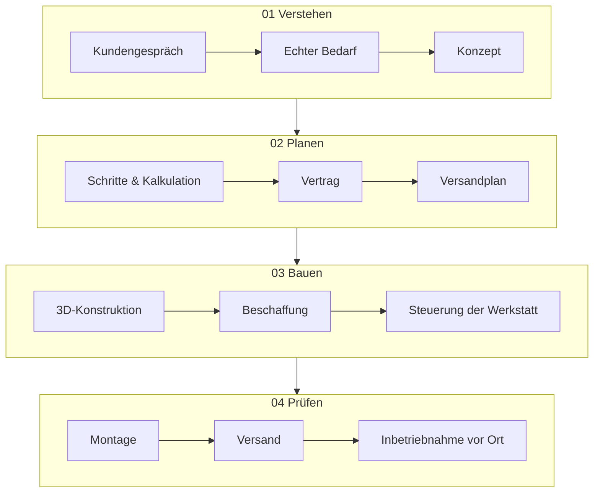

# 6 · Weg — Stahl und Silizium, immer beides

[Inhalt](../../README.de.md) · [English](../06-path.md) · [← 5 · Labor](05-lab.md) · Weiter: [7 · Vision →](07-vision.md)

> **In einer Zeile:** Technologie war immer Teil meiner Arbeit. Jetzt ist sie der Schwerpunkt.
> Auf der Website: [Weg](https://homensai.com/path.html) · [Profil](https://homensai.com/profile.html)

---

Diplom-Systemingenieur. Zwanzig Jahre Konstruktion von Maschinen, Produktionslinien und der Logik, die
sie steuert. Heute — dort, wo Software auf die physische Welt trifft.

## Zwei Welten, ein Weg

| Wann | Welt | Was |
|------|------|-----|
| 1980er | Vorstellungskraft | Science-Fiction: Roboter, neue Welten, Zivilisationen. |
| 1993 | Digital | Systemtechnik an der Universität · erste KI in Lisp. |
| 1997 | Digital | PGP · verteiltes Schlüsselknacken. |
| 2002 | Physisch | **UViS Technologii** · Mitglied des Gründungsteams, angestellt · Technik, Vertrieb und Projektsteuerung · das Team wuchs von 3 auf etwa 35 Personen. |
| 2008 | Physisch | **EKVIPTEH** · Mitgründer und Direktor · Team von bis zu etwa 26 · Sondermaschinen · über 1.000 Projekte · Export in 7 Länder. |
| 2010–2011 | Beides | Bei EKVIPTEH wichen Papierzeichnungen dem 3D-CAD (siehe unten). Kunden sahen die Maschine, bevor sie gebaut war. |
| 2018 | Beides | GPU-Rigs — Erfahrung aus Maschinenbau und Code trifft auf Kryptografie. |
| Heute | Beides | IT-Infrastruktur und lokale KI in Deutschland. |

### Wann 3D kam

Hier lassen sich drei verschiedene Dinge leicht verwechseln, deshalb halte ich sie auseinander:

| Was | Wann | Quelle |
|-----|------|--------|
| Erster Kontakt mit der 3D-Modellierung von Anlagen | ab 2002, wie ich es datiere | meine eigene Erinnerung |
| Papierzeichnungen bei EKVIPTEH zum Start | 2008 | meine eigenen Unterlagen |
| EKVIPTEH modelliert alles in 3D, mit SolidWorks und dann Inventor | etwa 2010–2011 | meine eigenen Unterlagen |

Das Datum 2002 habe ich hier keinem bestimmten Unternehmen oder Projekt zugeordnet, und ich behaupte
nicht, dass damals der breite Einsatz von 3D begann. Belegen kann ich den unternehmensweiten Wechsel
bei EKVIPTEH um 2010–2011, beschrieben in [Kapitel 3](03-principles.md#zu-p-03--niemals-aufschieben).

## Der ganze Kreislauf — in Stahl

UViS und EKVIPTEH, 2002–2023: einundzwanzig Jahre desselben vollständigen Zyklus. In meinen eigenen
Worten sah ein Auftrag bei EKVIPTEH so aus:

> Ich leitete die Firma direkt, 26 Leute. Ich pflegte die Website selbst. Ich nahm die Anrufe der
> Kunden entgegen und fand heraus, was sie brauchten — bis hin zum Konzept und zur Aufgabe. Ich
> überlegte, wie man es umsetzt, und zerlegte es in Schritte. Ich erklärte dem Kunden alles. Ich
> kalkulierte alles und schätzte die Kosten so, dass die Firma Gewinn machte. Dann einigten wir uns,
> unterschrieben den Vertrag, erhielten die Zahlung und planten jede Versandstufe — ein komplexes
> Projekt konnte in mehreren Etappen versandt werden. Ich gab den Konstrukteuren Aufgaben, und sie
> arbeiteten die Zeichnungen aus. Dann wurde das Material gekauft. Ich kontrollierte den
> Materialeingang und was auf Lager war oder nicht. Mit dem Werkstattleiter verteilte ich die Arbeit,
> legte Termine, Intensität, Prioritäten und die Wünsche des Kunden fest und kontrollierte dann alles;
> bei Schwierigkeiten half ich, sie zu lösen. Ich ging immer in die Werkstatt, um zu sehen, was fertig
> war, was nicht, wo die Probleme lagen. Dann wurde montiert, bezahlt, versandt, beim Kunden erneut
> montiert, und die Inbetriebnahme wurde dort kontrolliert. Wenn es Fragen gab, wurden sie geklärt.

Zu beachten, was persönlich ist und was Teamarbeit: Die obigen Schritte sind das, was **ich** getan
oder direkt kontrolliert habe; die Zeichnungen, die Fertigung, die Montage und die
Steuerungsprogrammierung wurden von Konstrukteuren, Werkstattmitarbeitern und einem Programmierer
erledigt.

Ich delegierte: Aufgabe, Termin, Ressourcen, Kontrolle — und griff nur ein, wenn nötig. Heute
delegiere ich an KI auf dieselbe Weise.

## Zahlen hinter der Geschichte

| Zahl | Was sie misst | Zeitraum |
|------|---------------|----------|
| 3 → etwa 35 | Personen im Team, UViS | 2002–2007 |
| etwa 3 Mio. $ | Jahresumsatz von UViS, im letzten Jahr | 2007 |
| bis zu etwa 26 | Personen im Team von EKVIPTEH, zum Höchststand | Spitzenjahre |
| etwa 0,9 Mio. $ | Jahresumsatz von EKVIPTEH, in jedem der beiden besten Jahre; andere Jahre etwa die Hälfte | 2012 und 2013 |
| über 1.000 | Projektordner im Projektarchiv, als Projekte gezählt | 2008–2023 |
| 7 | Länder, in die Ausrüstung exportiert wurde | 2008–2023 |

*Gerundete Zahlen aus meinen eigenen Unterlagen und meinem Projektarchiv: Umsatz, nicht Gewinn; nicht
geprüft.*

Zur Aussage, UViS sei 2002–2005 ein führender Hersteller von Zellbetonlinien in der GUS gewesen: So
hat das Unternehmen seine Stellung beschrieben, und so erinnere ich mich daran. Ich nenne kein
unabhängiges Marktranking; bitte lesen Sie es als Darstellung des Autors, nicht als geprüfte Tatsache.

## Ich lege die Steuerungslogik fest; der Programmierer setzt sie um

| Schritt | Was geschieht |
|---------|---------------|
| 01 Idee des Kunden | Gemeinsam mit dem Kunden von Hand skizziert. |
| 02 Logik | Ich schreibe den Algorithmus: Bedingungen, Gewichte, Dosierungen, Abläufe. |
| 03 Sensoren und Steuerungen | Welche Sensoren, welche Steuerungen zu kaufen sind. |
| 04 Spezifikation | Aufgabenstellung für die Konstrukteure und den Programmierer. |
| 05 Code und Bau | Der Programmierer programmiert und baut die Steuerung; Konstrukteure berechnen und zeichnen. |
| 06 Inbetriebnahme | Start vor Ort — bis es läuft. |

Sehen Sie sich die Schritte 02–04 noch einmal an: Genau so sieht die Arbeit mit KI heute aus. Die
Rolle hat sich nicht geändert. Der Ausführende schon. Den Steuerungscode habe ich nicht selbst
geschrieben; mein Teil war die Logik, die Spezifikation und die Prüfung.

## Mechanik und Software — zwei Stränge, ein System

Mechanismen, Steuerungen, Code. Zwei Stränge, die ich seit 1993 zusammenführe. Der **mechanische**
Strang sind Maschinen, Stahl, Produktion — physische Technik, nicht Computer-Hardware. Der
**Software**-Strang ist die IT.

Meine bisherige Erfahrung mit Robotik ist die Automatisierung von Maschinen und Produktionslinien; die
Arbeit an Robotern als solchen ist die Richtung, in die ich mich bewege, mit lokaler KI — kein
abgeschlossenes Projekt, das dieses Buch beschreibt.

## Wurzeln: was meine Denkweise geprägt hat

- **Science-Fiction.** Die Autoren waren Visionäre. Vieles, was sie beschrieben, haben Ingenieure
  später bearbeitet; ich erwarte, dass noch viel mehr folgt.
- **Das antike Rom.** Straßen und Aquädukte ab 312 v. Chr. — gebaut mit den besten Werkzeugen ihrer Zeit.
  Ich staune, wie Menschen mit der ihnen verfügbaren Technik Dinge erreichten, die auch heute schwer zu
  erreichen sind.
- **Chiffren.** Von Caesar bis PGP. Wie im alten Rom Briefe geschrieben wurden, die äsopische Sprache,
  wie Information verborgen wurde.

> Caesar-Chiffre, Verschiebung −3: `LPDJLQDWLRQ` → ?
> *(Die Antwort steht im [Glossar](glossary.md).)*

---

[Inhalt](../../README.de.md) · [English](../06-path.md) · [← 5 · Labor](05-lab.md) · Weiter: [7 · Vision →](07-vision.md)
