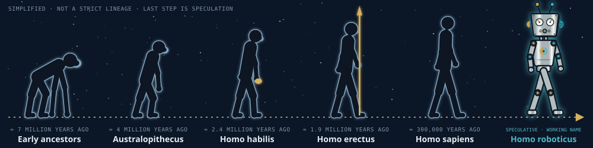
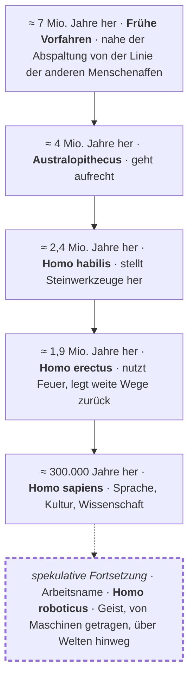

# 7 · Vision — Leben jenseits der Erde, getragen von Maschinen

[Inhalt](../../README.de.md) · [English](../07-vision.md) · [← 6 · Weg](06-path.md) · Weiter: [8 · Praxisleitfaden →](08-field-guide.md)

> **In einer Zeile:** Robotik und KI sind nach meiner Überzeugung der nächste Schritt — ein möglicher Weg, wie das Leben die Sterne erreicht.
> Auf der Website: [Vision](https://homensai.com/vision.html) (mit einer Animation von heute bis zur Galaxis)

---

Die Menschheit hat schon immer von anderen Welten geträumt. Dieses Kapitel ist meine persönliche
Sicht darauf, wie wir dorthin gelangen könnten. Es ist **spekulativ**: eine Veranschaulichung einer
Idee, keine Prognose. Nachprüfbare Fakten sind in den
[Anmerkungen und Quellen](notes.md#verwendete-wissenschaftliche-fakten) mit einer Quelle versehen;
Überzeugungen und Szenarien sind als solche gekennzeichnet.

## Der Körper ist für die Erde gemacht. Die Maschine nicht.

| | | |
|---|---|---|
| **V-01 · Körper** | **Menschen sind ortsgebunden.** | Schwerkraft, Luft, Wasser, ein enger Temperaturbereich, Schutz vor Strahlung. Ein Mensch braucht ein Stück Erde, um am Leben zu bleiben — und nimmt es auf jede Reise mit. |
| **V-02 · Maschine** | **Maschinen können warten.** | Eine Maschine braucht weder Luft noch Nahrung, und — wenn sie dafür besonders ausgelegt ist, mit strahlungsverträglicher Elektronik und Wärmeregelung — kann sie im Vakuum und in der Kälte arbeiten. Sie kann repariert, kopiert und im Prinzip für lange Zeit in einen Zustand mit minimalem Energiebedarf versetzt werden. Gewöhnliche Roboter sind dafür nicht gebaut; die besondere Auslegung ist die Voraussetzung. Entfernung und Zeit sind nicht mehr der Hauptfeind. |
| **V-03 · Geist** | **KI macht sie unabhängig.** | Ein Funksignal braucht je nach Stellung der Planeten 3 bis 22 Minuten in einer Richtung zum Mars. Bei solchen Verzögerungen ist Fernsteuerung in Echtzeit nicht möglich: Eine Maschine muss vieles selbst entscheiden — innerhalb von Regeln und Prüfungen, die wir ihr geben. Fernbefehle funktionieren weiterhin; sie können eine Maschine nur nicht Sekunde für Sekunde steuern. |

## Die Entwicklungslinie

Meine persönliche Überzeugung: ***Homo roboticus*** könnte die nächste Stufe in der Entwicklung der
Menschheit sein — ein weiterer Schritt auf einer Linie, die von frühen Vorfahren bis zu uns reicht.
Jeder Schritt veränderte, was ein Körper tun kann oder wo ein Geist leben kann. Dieser könnte einer der
letzten sein: Der Geist verlässt die Grenzen der Biologie.

  

Die letzte Figur ist der Roboter von meiner Website: ein verchromter „Fernseher“-Kopf, zwei Antennen mit
einer goldenen und einer türkisfarbenen Kugel, Instrumentenaugen und das Zeichen aus Zahnrad und
Schaltkreis auf der Brust — Gold für die physische, Türkis für die digitale Welt. Die Beschriftungen im
Bild sind englisch und in beiden Ausgaben gleich.

Dies ist eine **vereinfachte Darstellung**, keine strenge biologische Klassifikation. Die tatsächliche
Evolution des Menschen ist ein verzweigter Busch mit überlappenden Arten, keine gerade Linie, und die
Zeitangaben sind ungefähre Werte, die von den Funden und den verwendeten Definitionen abhängen. Der
gestrichelte letzte Schritt ist keine Wissenschaft: Er ist die spekulative Fortsetzung, um die es in
diesem Kapitel geht.

## Nach dem Homo sapiens — was dann?

Das ist meine persönliche Meinung: Heutige KI und Robotik sind die nächste Stufe in der Entwicklung des
*Homo sapiens*. **Nicht das Ende der Menschen — die Fortsetzung des Lebens mit anderen Mitteln.**

| Heute | → | Arbeitsname |
|-------|---|-------------|
| ***Homo sapiens*** — Biologie, ein Planet | → | ***Homo roboticus*** — Geist, Maschinen, viele Welten |

Es gibt keinen offiziellen Namen, und es ist kein biologischer Begriff — nur eine kurze Art, „der
nächste Schritt“ zu sagen. Verwandte Ideen anderer: *Mind Children* (Hans Moravec, 1988) und sich selbst
vervielfältigende Raumsonden (die Idee geht zurück auf John von Neumanns Arbeiten zu selbstreproduzierenden
Automaten). Die Wortverbindung „Homo roboticus“ wurde auch schon von anderen Autoren verwendet; siehe
[Anmerkungen und Quellen](notes.md#frühere-verwendung-des-begriffs-homo-roboticus). Was ich hier
vorlege, ist meine eigene Vision, die um diesen Begriff herum gebaut ist.

## Das Finale: ein möglicher Weg zur interstellaren Reise

Meine persönliche Überzeugung: **ein möglicher Weg**, wie ein Mensch — als Individuum — durch das
Universum reisen kann, ist dieser. *Wenn* sich Bewusstsein in einen Roboter übertragen lässt, wird ein
Mensch zum *Homo roboticus*: Das Leben eines Geistes müsste nicht enden, und dieser Geist könnte überallhin
gehen. Es ist ein hypothetisches Szenario, kein bewiesener und nicht der einzige Weg; andere Wege, etwa
langsame Generationenschiffe oder biologische Anpassung, sind denkbar.

| Ein Mensch | → | Homo roboticus |
|------------|---|----------------|
| Geist in einem Gehirn — begrenzt durch einen Körper und ein Leben | → | Geist in einer Maschine — keine biologische Grenze, jede Welt |

**Ein ehrlicher Hinweis:** Heute ist das Science-Fiction. Niemand weiß, ob es möglich ist oder ob ein
übertragener Geist noch dieselbe Person wäre — die Frage ist offen (sie heißt *Mind Uploading*). Ich
behandle es als den Schlusspunkt der ganzen Idee: eine Richtung zum Nachdenken, kein Versprechen.

## Wie es sich entfalten könnte

Eine Veranschaulichung, kein Zeitplan.

| Wann | Was |
|------|-----|
| **Heute** | Robotische Raumfahrzeuge haben Orte erreicht, die Menschen nicht erreicht haben. Rover fahren auf dem Mars; Voyager 1, 1977 gestartet, ist seit 2012 im interstellaren Raum und steht weiterhin in Kontakt mit der Erde (NASA; geprüft am 5. Oktober 2026). |
| **+100 Jahre** | Ein Szenario: robotische Außenposten. Roboter könnten auf dem Mond, auf dem Mars und auf Asteroiden Rohstoffe abbauen, bauen und reparieren, lange vor den Menschen — oder an ihrer Stelle. |
| **+1.000 Jahre** | Ein Szenario: das Sonnensystem als Werkstatt. Planeten und Monde sind erreicht; Versorgungslinien laufen selbstständig, unter geprüfter Kontrolle. |
| **+10.000 … 1 Million Jahre** | Ein Szenario: Nachbarsterne. Langsame, sich selbst vervielfältigende Sonden bauen aus lokalem Material Kopien und ziehen weiter, von Stern zu Stern. |
| **+Millionen Jahre** | Ein Szenario: die Galaxis. Die Milchstraße misst grob 100.000 Lichtjahre im Durchmesser; veröffentlichte Schätzungen, wie schnell sich selbst vervielfältigende Sonden sie durchqueren könnten, sind spekulativ und reichen bis zu vielen Millionen Jahren. Was sich ausbreitet, ist nicht Metall — es sind Neugier und Gedächtnis des Lebens, das hier begann. |

## Den Geist befreien: je weniger Routine, desto mehr Ideen

Meine eigene Erfahrung: Je mehr ich meine Hände und meinen Kopf von zeitfressender Routine-Programmierung
befreie, desto mehr Ideen kommen. Je mehr ich mir erlaube zu träumen und global zu denken, desto mehr
Dinge kann ich tatsächlich verwirklichen, die es vorher nicht gab.

Heute ist KI ein sehr starkes Werkzeug, um viele vorgestellte Ideen umzusetzen, die sich als digitaler
Code ausdrücken lassen. Nicht nur Programme — auch Konzepte, Websites, Diagramme und Schaltpläne,
Lernmaterialien. (Dieses Buch ist ein Beispiel; siehe [Anmerkungen](notes.md#über-diesen-text).)

Für alle, die Erste sein wollen:

1. **Investieren Sie viel Zeit in die Weite des Blicks.** Sie ist heute die knappe Ressource, nicht die Tippgeschwindigkeit.
2. **Kennen Sie Ihre Anforderungen und Ihre Prüfungen.** Sie können nur abgeben — und prüfen —, was Sie
   definieren und verifizieren können.
3. **Geben Sie die Routine ab, behalten Sie die Prüfung.** Schnell, aber kontrolliert.

> Menschen träumen. Maschinen gehen. Und was reist, ist unsere Neugier.

## Mitmachen

Wenn es solche Projekte gibt, möchte ich dabei sein. Diese Idee beschäftigt mich mein ganzes Leben. Ich
würde gern an Raumfahrtrobotik, autonomen Systemen und dem Bauen außerhalb der Erde arbeiten — oder an
allem, was sie näher bringt.

Was ich mitbringe: Steuerungslogik für Maschinen, Projekt- und Teamführung und einen Systemblick — von der
Idee bis zur laufenden Maschine. Robotik-Integration ist die Richtung, in die ich mich bewege, und der
Einsatz, den ich für diese übertragbaren Fähigkeiten im Sinn habe; es ist noch kein Projekt, das ich
vorzeigen kann.

→ [Kontakt aufnehmen](https://homensai.com/contact.html) · [Mein Profil](https://homensai.com/profile.html)

---

[Inhalt](../../README.de.md) · [English](../07-vision.md) · [← 6 · Weg](06-path.md) · Weiter: [8 · Praxisleitfaden →](08-field-guide.md)
