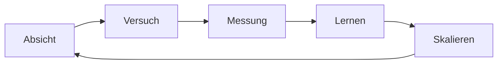

# 8 · Praxisleitfaden — die Methode als Checklisten

[Inhalt](../../README.de.md) · [English](../08-field-guide.md) · [← 7 · Vision](07-vision.md) · Weiter: [Glossar →](glossary.md)

> **In einer Zeile:** die Ideen dieses Buches, umgesetzt in Schritte, die Sie morgen bei Ihrer eigenen Arbeit nutzen können.

---

Dieses Kapitel fügt keine neuen Ideen hinzu. Es nimmt die aus den Kapiteln 2–6 und macht daraus
Checklisten. Kopieren Sie sie, ändern Sie sie, nutzen Sie sie. Ein vollständiges, ausgeführtes Beispiel,
das den Abschnitten 1–4 von Anfang bis Ende folgt, steht in
[examples/order-table](../../examples/order-table/README.de.md); eine kopierbare Form der Absichtskarte
ist [templates/intent-card.de.md](../../templates/intent-card.de.md).

## 1. Vor dem Start: die Absichtskarte

Schreiben Sie dies auf eine Seite, bevor Sie etwas bauen — mit Menschen, mit KI oder allein.

```text
ABSICHTSKARTE
-------------
Was will ich?                   (ein Satz, ohne Fachwörter)
Warum?                          (was ändert sich, wenn es existiert)
Für wen?
Wie sieht „fertig“ aus?         (eine messbare Prüfung — Gewicht, Zeit, eine Zahl, ein Test)
Was darf NICHT passieren?       (Sicherheit, Geld, Daten, Termin)
Was weiß ich schon?             (Daten, Zeichnungen, Beispiele, alte Projekte)
Was ist unsicher?               (auflisten — dort fangen Sie an)
Wie werde ich es prüfen?        (wer oder was prüft; was ich verstehen muss, um es zu beurteilen)
```

Wenn Sie **„wie sieht fertig aus“** oder **„wie werde ich es prüfen“** nicht ausfüllen können, sind Sie
noch nicht bereit zu delegieren — weder an einen Menschen noch an KI. KI verringert die manuelle Arbeit;
sie nimmt nicht die Notwendigkeit ab, Anforderungen, Randbedingungen und die Prüfung des Ergebnisses
zu verstehen.

## 2. Zerlegen: von „Ist es überhaupt möglich?“ zu Schritten

Aus [Kapitel 3 · Ungewissheit](03-principles.md#ungewissheit-mit-zweifel-beginnen-mit-einem-ergebnis-enden).

- [ ] Schreiben Sie die große Aufgabe in einer Zeile auf.
- [ ] Teilen Sie sie in 3–7 Teile. Jeder Teil braucht seine eigene „Fertig“-Prüfung.
- [ ] Teilen Sie jeden Teil weiter, bis jeder Schritt in einen Arbeitstag passt.
- [ ] Markieren Sie die Schritte, bei denen Sie nicht wissen, wie sie gehen. Machen Sie einen davon **zuerst** — dort sitzt der Zweifel.
- [ ] Gehen Sie Schritt für Schritt weiter und testen Sie jeden Schritt gegen seine Prüfung.
- [ ] Besteht ein Schritt seine Prüfung nicht, wählen Sie eines von drei Ergebnissen: **untersuchen**
      (mehr herausfinden), **Anforderungen ändern** (Umfang, Kosten, Zeit) oder **abbrechen** — und
      den Grund festhalten.

Nicht jede Aufgabe lässt sich innerhalb ihrer Grenzen lösen. Ein bewusster Abbruch mit schriftlichem
Grund ist ein gutes Ergebnis, kein Versagen der Methode.

## 3. Delegieren wie ein Direktor

Aus [Kapitel 3 · P-05](03-principles.md#zu-p-05--delegieren). Dieselben vier Teile für einen Menschen und
für KI:

| Teil | Für einen Menschen | Für KI |
|------|--------------------|--------|
| **Aufgabe** | Was und warum, in einfachen Worten | Die Absichtskarte + Beispiele guter Ergebnisse |
| **Termin** | Datum und Zwischenstände | Umfang pro Durchlauf: ein Schritt, nicht das ganze Projekt |
| **Ressourcen** | Budget, Werkzeuge, Zugang, Personen | Dateien, Daten, Kontext — und nichts, was sie nicht braucht |
| **Kontrolle** | Zwischenstände, Besuche in der Werkstatt | Tests, Vergleiche, Zweitmeinung, Ihre eigene Durchsicht |

Delegieren Sie nur, was Sie definieren und prüfen können. Greifen Sie nur ein, wenn es wirklich darauf
ankommt — aber führen Sie die Kontrolle **immer** durch.

## 4. Prüfen wie ein Ingenieur

Aus [Kapitel 5 · Methode](05-lab.md#methode-erst-fertig-wenn-geprüft).

- [ ] Gibt es eine Zahl, einen Test oder eine Messung, die zeigt, dass es funktioniert?
- [ ] Habe ich es an einem echten Fall geprüft — einer echten Maschine, einem echten Dokument, einem echten Kunden?
- [ ] Habe ich die Ränder geprüft — Höchstlast, leere Eingabe, falsche Eingabe?
- [ ] Ist auch das Scheitern festgehalten, mit seiner Zahl?
- [ ] Würde ich dieses Ergebnis mit meinem Namen unterschreiben?

Kein Ergebnis zählt, bevor es geprüft ist.

## 5. Die Arbeit aufteilen

Aus [Kapitel 3 · Arbeitsteilung](03-principles.md#arbeitsteilung). Nehmen Sie eine normale Arbeitswoche
und sortieren Sie, was Sie getan haben:

| Geht an Maschinen (mit Prüfungen) | Bleibt bei Ihnen |
|-----------------------------------|------------------|
| Berichte, Schreibarbeit | Ideen |
| Berechnungen, Terminpläne | Entscheidungen |
| Wiederholte Prüfungen | Verantwortung |
| Dateneingabe und Recherche | Beziehungen und Vertrauen |
| Standardantworten | Geschmack und Bedeutung |

Geben Sie die linke Spalte Punkt für Punkt ab. Nutzen Sie die gewonnene Zeit für die rechte Spalte — und
für die **Weite des Blicks**.

## 6. Wissen, wohin Ihre Daten gehen

Ein Modell auf dem eigenen Rechner zu betreiben ist nicht dasselbe wie der Nachweis, dass keine Daten
nach außen gelangen. Prüfen Sie den gesamten Aufbau, nicht nur das Modell.

- [ ] Enthalten diese Daten Kunden, Verträge, Geld, persönliche Angaben? Wenn nicht, ist der Rest dieser
      Liste weniger wichtig.
- [ ] **Modell:** Wo läuft es — auf Ihrem Rechner, Ihrem Server oder dem eines anderen? Stammt die
      Modelldatei aus einer Quelle, der Sie vertrauen?
- [ ] **Werkzeuge und Plug-ins:** Ruft das Werkzeug, der Agent, die Browser-Erweiterung oder das Plug-in
      Websuche, eine API oder einen Cloud-Dienst auf? Welche sind eingeschaltet?
- [ ] **Netzwerk:** Beobachten Sie bei einem Testlauf die ausgehenden Verbindungen (Firewall-Protokoll,
      Router-Protokoll oder ein Mitschnitt auf Ihrem eigenen Rechner). Geht etwas an eine Adresse, die
      Sie nicht erwartet haben? Sperren Sie den ausgehenden Verkehr des Testrechners und sehen Sie, ob
      die Aufgabe noch funktioniert.
- [ ] **Telemetrie und Updates:** Senden Modell-Runner, Oberfläche und Betriebssystem Nutzungsstatistiken
      oder Absturzberichte? Lassen sie sich abschalten, und haben Sie geprüft, dass sie aus sind?
- [ ] **Protokolle und Verlauf:** Wo werden Eingaben und Antworten gespeichert? Wer kann diese Dateien
      lesen? Wie lange werden sie aufbewahrt?
- [ ] **Synchronisation und Sicherungen:** Kopiert ein Cloud-Laufwerk, eine Notizen-App oder ein
      Sicherungsdienst die Ordner, in denen Daten, Protokolle oder Chatverlauf liegen?
- [ ] **Entscheidung:** Schreiben Sie auf, was das Haus verlässt, falls etwas es verlässt, und ob das für
      diese Daten akzeptabel ist. Wenn Sie es nicht sagen können, behandeln Sie die Daten als
      offengelegt und verwenden Sie eine Kopie ohne die sensiblen Teile.

Diese Checkliste ist ein Weg, es herauszufinden, keine Garantie. Sie ersetzt keine datenschutzrechtliche
Prüfung, wo das Gesetz eine verlangt.

## 7. Ein neues Werkzeug in einer Woche testen

Aus [Kapitel 3 · P-03, die besten Werkzeuge — heute](03-principles.md#zu-p-03--niemals-aufschieben) und dem
[Labor](05-lab.md).

| Tag | Tun |
|-----|-----|
| 1 | Schreiben Sie die Frage auf: *Was soll dieses Werkzeug für mich tun, und wie werde ich es messen?* |
| 2 | Richten Sie es an einem kleinen, echten Stück Ihrer eigenen Arbeit ein. |
| 3–4 | Lassen Sie es laufen. Messen. Notieren Sie, was gescheitert ist. |
| 5 | Vergleichen Sie mit Ihrer bisherigen Arbeitsweise: Zeit, Qualität, Kosten. |
| 6 | Entscheiden Sie: behalten, verwerfen oder mit anderem Aufbau erneut testen. |
| 7 | Wenn Sie es behalten — schreiben Sie eine einseitige Notiz: wie, wann, mit welchen Prüfungen. |

Vertrauen Sie nicht, weil es neu ist. Lehnen Sie nicht ab, weil es neu ist. Testen Sie.

## 8. Bevor KI eine Maschine beeinflusst

Für alles, was sich bewegt, heizt, schneidet oder schaltet. Dies ist ein Entwurf, keine Zertifizierung und
keine Anleitung für eine bestimmte Maschine; befolgen Sie die Normen, die Unterlagen des Herstellers und
eine qualifizierte Sicherheitsbeurteilung.

- [ ] **Anforderungen:** was die Maschine tun und nicht tun darf; Grenzen für Geschwindigkeit, Kraft,
      Temperatur; was „sicherer Zustand“ heißt; wer sie anhalten kann und wie.
- [ ] **Modell oder Prüfstand:** Lassen Sie die Logik zuerst ohne echte Last und ohne Personen in der
      Nähe laufen.
- [ ] **Begrenzter Versuch:** reduzierte Geschwindigkeit, Kraft oder Umfang; ein Hardware-Halt in
      Reichweite; jemand, der beobachtet; schriftliche Bestehenskriterien.
- [ ] **Kontrollierter Einsatz:** Überwachung, Protokolle, ein Weg zurück zum früheren Verhalten.
- [ ] Nach einer gescheiterten Stufe gehen Sie eine Stufe zurück — niemals vorwärts.

## 9. Der Wachstumskreislauf



Führen Sie ihn mit der nächsten Idee erneut aus. Wenn es funktioniert, ist jede Runde schneller als die
vorige.

---

[Inhalt](../../README.de.md) · [English](../08-field-guide.md) · [← 7 · Vision](07-vision.md) · Weiter: [Glossar →](glossary.md)
